# Cronus — AI YouTube Shorts Automation SaaS

> **Comprehensive Technical Documentation**
> Version 1.0 · Last updated: 2026-05-28
> Repository: `github.com/TANMaYtO/YT-AUTONOMOUS-BOT`

---

## Table of Contents

1. [Executive Summary](#1-executive-summary)
2. [Technology Stack](#2-technology-stack)
3. [Project Structure](#3-project-structure)
4. [System Architecture](#4-system-architecture)
5. [LangGraph Pipeline Architecture](#5-langgraph-pipeline-architecture)
6. [Node-by-Node Technical Reference](#6-node-by-node-technical-reference)
7. [State Management — VideoState](#7-state-management--videostate)
8. [Supabase Database Schema](#8-supabase-database-schema)
9. [Security & Encryption](#9-security--encryption)
10. [Supabase Bridge (SaaS Adapter)](#10-supabase-bridge-saas-adapter)
11. [Master Scheduler](#11-master-scheduler)
12. [Uploader System](#12-uploader-system)
13. [Frontend Dashboard (cronus-web)](#13-frontend-dashboard-cronus-web)
14. [Design System](#14-design-system)
15. [Environment Variables](#15-environment-variables)
16. [Dependencies](#16-dependencies)
17. [Development Phases & History](#17-development-phases--history)
18. [Design Decisions & Rationale](#18-design-decisions--rationale)
19. [Known Limitations & Tech Debt](#19-known-limitations--tech-debt)
20. [Future Roadmap (Phase 3)](#20-future-roadmap-phase-3)

---

## 1. Executive Summary

**Cronus** is an autonomous AI agent that generates and uploads YouTube Shorts on a daily cadence with zero human intervention. The system picks trending tech topics, writes humorous "brainrot" dialogue scripts between anime characters, synthesizes speech with word-level timestamps, assembles broadcast-quality vertical video with burnt-in subtitles, generates SEO-optimized metadata, and uploads to YouTube via OAuth — all orchestrated by a LangGraph state machine.

The project began as a local CLI tool and has evolved into a multi-tenant SaaS platform with a Next.js dashboard, Supabase backend, and a master scheduler capable of running pipelines for multiple users concurrently.

**Key metrics at time of writing:**
- 16 videos successfully generated and uploaded to a real YouTube channel
- 7-node pipeline with full retry logic and error routing
- Sub-60-second pipeline execution per video (excluding upload)
- ~45 MB average output file size (1080×1920 @ 30fps, H.264)

---

## 2. Technology Stack

| Layer | Technology | Version | Purpose |
|---|---|---|---|
| **Agent Orchestration** | LangGraph | latest | StateGraph-based pipeline with conditional edges |
| **LLM** | Google Gemini Flash | 2.0 | Script generation, metadata generation |
| **TTS (Primary)** | Kokoro ONNX | local | Word-level timestamps, offline inference |
| **TTS (Fallback)** | edge-tts | latest | Cloud fallback when Kokoro fails |
| **Video Assembly** | FFmpeg | system | libx264 encoding, libass subtitle burn |
| **Backend Runtime** | Python | 3.10 | Pipeline, uploader, scheduler |
| **Frontend Framework** | Next.js | 14.2.35 | App Router, Server Components, API Routes |
| **UI Library** | React | 18 | Component layer |
| **Styling** | TailwindCSS | 3.x | Utility-first CSS with custom theme |
| **Type Safety** | TypeScript | 5.x | Frontend type checking |
| **Database** | Supabase (PostgreSQL) | hosted | User configs, videos, auth, connections |
| **Auth** | Supabase Auth | hosted | Email/password authentication |
| **OAuth** | Google OAuth 2.0 | v2 | YouTube Data API authorization |
| **Upload API** | YouTube Data API | v3 | Video upload, metadata management |
| **Trends** | PyTrends | latest | Google Trends scraping for topic discovery |
| **Validation** | Pydantic | v2 | Structured output validation for LLM responses |
| **Retry** | Tenacity | latest | Exponential backoff on API/network calls |
| **Alerts** | Telegram Bot API | — | Failure notifications, daily summaries |

---

## 3. Project Structure

```
e:\AGENT/
│
├── agent/                          # ── Python LangGraph Pipeline ──
│   ├── __init__.py                 # Package init
│   ├── orchestrator.py             # LangGraph StateGraph builder — wires all 7 nodes
│   ├── state.py                    # VideoState TypedDict (40+ fields)
│   ├── config.py                   # YAML config loader with defaults + validation
│   ├── models.py                   # Pydantic models for node output validation
│   ├── history.py                  # History tracking (local → Supabase migration)
│   ├── alerts.py                   # Telegram bot alerts (failures + summaries)
│   ├── startup_checks.py           # Pre-flight checks (FFmpeg, disk, OAuth, API keys)
│   ├── trends.py                   # PyTrends Google Trends integration
│   ├── utils.py                    # Shared utility functions
│   ├── run_generation.py           # Daily generation runner (dual mode)
│   ├── supabase_bridge.py          # SaaS adapter: Supabase ↔ pipeline interface
│   └── nodes/                      # ── Pipeline Nodes ──
│       ├── idea_generator.py       # Node 1: Topic + character selection
│       ├── script_writer.py        # Node 2: Gemini Flash dialogue generation
│       ├── image_picker.py         # Node 3: Character image selection
│       ├── asset_fetcher.py        # Node 4: TTS audio generation (Kokoro ONNX)
│       ├── video_assembler.py      # Node 5: FFmpeg 2-pass video assembly
│       ├── metadata_generator.py   # Node 6: YouTube metadata via Gemini Flash
│       └── queue_manager.py        # Node 7: Queue management + scheduling
│
├── uploader/                       # ── YouTube Upload System ──
│   ├── youtube_upload.py           # YouTube Data API v3 upload with retry
│   ├── upload_next.py              # Picks next pending video, uploads, cleans up
│   └── scheduler.py                # Placeholder for OS-level task scheduling
│
├── master_scheduler.py             # SaaS master loop (polls Supabase, runs per-user)
│
├── cronus-web/                     # ── Next.js 14 Frontend (SaaS Dashboard) ──
│   └── src/app/
│       ├── page.tsx                # Landing page (brutalist dark theme)
│       ├── auth/                   # Supabase Auth (login/signup)
│       ├── onboard/                # 4-step onboarding wizard
│       │   ├── youtube/            # Step 1: Connect YouTube via OAuth
│       │   ├── niche/              # Step 2: Select content niche/topics
│       │   ├── schedule/           # Step 3: Configure upload schedule
│       │   └── plan/               # Step 4: Choose pricing plan
│       ├── dashboard/
│       │   ├── page.tsx            # Main dashboard (stats, queue, history)
│       │   ├── settings/page.tsx   # Settings panel (5 sections + danger zone)
│       │   └── pricing/page.tsx    # Pricing cards (Free vs Pro)
│       └── api/
│           ├── auth/youtube/       # OAuth callback (AES-256-GCM encrypt)
│           ├── configs/update/     # User config CRUD
│           ├── plans/              # Plan management
│           ├── videos/retry/       # Retry failed uploads
│           ├── notifications/      # Notification preferences
│           └── agent/status/       # Agent status endpoint
│
├── assets/                         # ── Static Assets ──
│   ├── characters/                 # Character image folders (Gojo, Luffy, Nobita…)
│   ├── backgrounds/                # Gameplay video clips for backgrounds
│   ├── music/                      # Background music tracks
│   └── temp/                       # Temporary working directory (per-run)
│
├── models/kokoro/                  # Kokoro TTS ONNX model files
├── credentials/                    # OAuth credentials (gitignored)
├── config.yaml                     # Local-mode pipeline configuration
├── requirements.txt                # Python dependencies (~50 packages)
├── .env                            # Environment variables (gitignored)
└── .env.local                      # Frontend environment variables (gitignored)
```

---

## 4. System Architecture

### High-Level Architecture Diagram

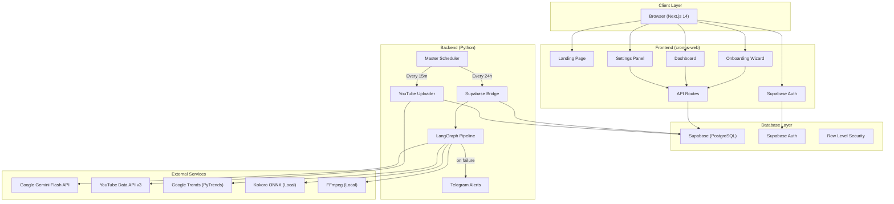

### Data Flow Architecture

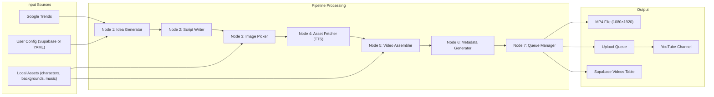

### Multi-Tenant Execution Model

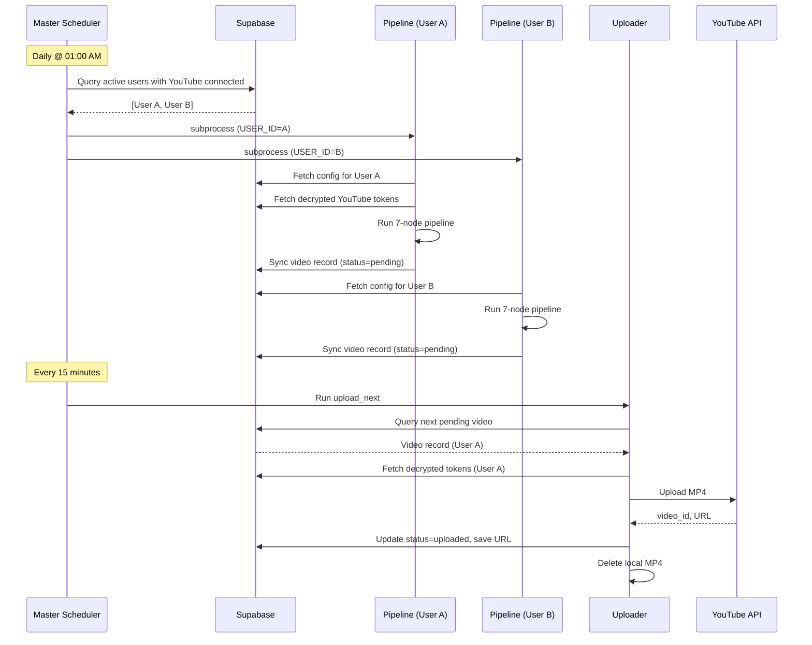

---

## 5. LangGraph Pipeline Architecture

### Orchestrator (`agent/orchestrator.py`)

The orchestrator builds a `StateGraph` from `langgraph.graph` that connects 7 nodes in a linear sequence with conditional error exits.

```python
# Simplified orchestrator structure
from langgraph.graph import StateGraph, END
from agent.state import VideoState

def build_graph() -> StateGraph:
    """Build and compile the 7-node video generation pipeline."""
    graph = StateGraph(VideoState)

    # Register nodes
    graph.add_node("idea_generator", idea_generator_node)
    graph.add_node("script_writer", script_writer_node)
    graph.add_node("image_picker", image_picker_node)
    graph.add_node("asset_fetcher", asset_fetcher_node)
    graph.add_node("video_assembler", video_assembler_node)
    graph.add_node("metadata_generator", metadata_generator_node)
    graph.add_node("queue_manager", queue_manager_node)

    # Set entry point
    graph.set_entry_point("idea_generator")

    # Wire conditional edges (error → END)
    for src, dst in [
        ("idea_generator", "script_writer"),
        ("script_writer", "image_picker"),
        ("image_picker", "asset_fetcher"),
        ("asset_fetcher", "video_assembler"),
        ("video_assembler", "metadata_generator"),
        ("metadata_generator", "queue_manager"),
    ]:
        graph.add_conditional_edges(
            src,
            lambda state: "end" if state.get("error") else "continue",
            {"continue": dst, "end": END},
        )

    graph.add_edge("queue_manager", END)
    return graph.compile()
```

### Pipeline Flow Diagram

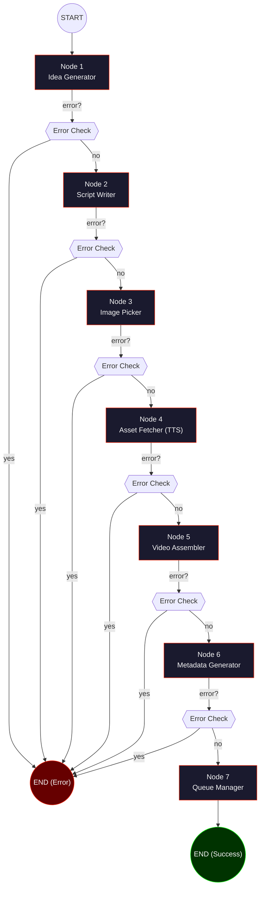

### Node Contract

Every node function in the pipeline adheres to the following contract:

```python
def node_function(state: dict) -> dict:
    """
    Node contract:
    - Accepts: VideoState dict (40+ fields)
    - Returns: Same dict with updates merged
    - On error: Sets state['error'] = "description"
    - External calls: Wrapped in @retry decorator (tenacity)
    - Entry/Exit: Logged with timestamp to logs/ directory
    - Validation: validate_state_for_node() checks required upstream keys
    """
    ...
```

**Invariants:**
1. Nodes never mutate the input state directly — they return a new dict of updates
2. If `state['error']` is truthy, the conditional edge routes to `END` immediately
3. Every node logs entry and exit timestamps to `logs/` for traceability
4. All external API calls (Gemini, PyTrends) use `@retry` decorators from tenacity
5. Each node validates its required input keys via `validate_state_for_node()`

---

## 6. Node-by-Node Technical Reference

### Node 1: Idea Generator (`agent/nodes/idea_generator.py`)

**Purpose:** Select a trending topic and assign two characters with distinct dialogue roles.

**Inputs (from state):**
| Key | Type | Source |
|---|---|---|
| `config` | `dict` | Loaded from YAML or Supabase |

**Outputs (written to state):**
| Key | Type | Description |
|---|---|---|
| `topic` | `str` | Selected trending topic |
| `character_a` | `str` | Character name (explainer role) |
| `character_b` | `str` | Character name (confused/reactive role) |
| `character_a_role` | `str` | `"explainer"` |
| `character_b_role` | `str` | `"confused"` |
| `run_id` | `str` | UUID for this pipeline run |

**Algorithm:**
1. Call PyTrends API to fetch trending Google queries in the tech/programming niche
2. If PyTrends fails (rate-limited, network error), fall back to a hardcoded topic pool defined in config
3. Apply **weighted random selection** biased against recently-used topics:
   - Topics used in the last 30 videos get a weight penalty
   - Newer topics (from last 5 videos) get the highest penalty
   - Ensures content diversity without hard blocking any topic
4. Select 2 characters from the configured character list
5. Randomly assign roles: one as the "explainer" (knows the topic, teaches), one as "confused" (asks silly questions, reacts)
6. Run deduplication check against the last 30 generated videos to avoid exact topic+character combos
7. Generate a UUID `run_id` for tracing this pipeline execution

**Key Design Decisions:**
- **Weighted random vs. hard exclusion:** We chose weighted random over hard topic exclusion because the topic pool can be small. Hard exclusion risks exhausting the pool. Weighted randomness statistically discourages repeats while never blocking.
- **PyTrends fallback pool:** PyTrends is notoriously unreliable (Google rate-limits aggressively). The fallback pool ensures the pipeline never stalls on topic selection.
- **30-video dedup window:** Chosen as a balance between freshness and pool size. With typical character pools of 6-8 characters and topic pools of 20+, 30 videos is ~4 days of content at max rate.

---

### Node 2: Script Writer (`agent/nodes/script_writer.py`)

**Purpose:** Generate a humorous "brainrot" dialogue script between the two assigned characters using Google Gemini Flash.

**Inputs (from state):**
| Key | Type | Source |
|---|---|---|
| `topic` | `str` | Node 1 |
| `character_a` | `str` | Node 1 |
| `character_b` | `str` | Node 1 |
| `character_a_role` | `str` | Node 1 |
| `character_b_role` | `str` | Node 1 |

**Outputs (written to state):**
| Key | Type | Description |
|---|---|---|
| `script` | `list[dict]` | List of dialogue lines |
| `script_raw` | `str` | Raw JSON string from Gemini |

**Script Line Schema (Pydantic `ScriptOutput`):**
```python
class ScriptLine(BaseModel):
    """Single line of dialogue."""
    character: str          # Character name
    dialogue: str           # The spoken text
    emotion: str            # e.g., "excited", "confused", "shocked"

class ScriptOutput(BaseModel):
    """Validated script output from Gemini."""
    lines: list[ScriptLine]  # 8-12 dialogue lines
```

**Gemini Prompt Engineering:**
The system prompt enforces:
- Gen-Z/brainrot humor style (internet slang, exaggerated reactions)
- 8-12 lines of dialogue (optimized for 30-50 second Shorts)
- Each line tagged with character name and emotion
- The "explainer" character delivers actual tech facts
- The "confused" character provides comedic reactions
- JSON-only output format (no markdown wrapping)

**Error Handling:**
- `@retry(stop=stop_after_attempt(3), wait=wait_exponential(min=2, max=10))` on the Gemini API call
- If JSON parsing fails, retry with a "fix the JSON" follow-up prompt
- If Pydantic validation fails, log the raw response and set `state['error']`

**Key Design Decisions:**
- **Gemini Flash over GPT-4:** Cost efficiency. Flash is free-tier eligible and fast enough for dialogue generation. GPT-4 would cost ~$0.03-0.06 per script with no quality gain for this use case.
- **Pydantic validation:** Ensures every script line has all required fields. Without this, downstream nodes (TTS, subtitles) would crash on missing fields.
- **8-12 line constraint:** Empirically tested. Fewer than 8 lines makes a video too short (<20s, poor Shorts performance). More than 12 lines exceeds the 60s Shorts limit.

---

### Node 3: Image Picker (`agent/nodes/image_picker.py`)

**Purpose:** Select character images from the local asset library.

**Inputs (from state):**
| Key | Type | Source |
|---|---|---|
| `character_a` | `str` | Node 1 |
| `character_b` | `str` | Node 1 |

**Outputs (written to state):**
| Key | Type | Description |
|---|---|---|
| `character_a_image` | `str` | Absolute path to character A image |
| `character_b_image` | `str` | Absolute path to character B image |

**Algorithm:**
1. Map character name → folder path in `assets/characters/{name}/`
2. List all valid image files (`.png`, `.jpg`, `.webp`) in the folder
3. Select one random image per character
4. Validate file existence (guard against deleted/moved assets)

**Asset Directory Convention:**
```
assets/characters/
├── gojo/
│   ├── gojo_1.png
│   ├── gojo_2.png
│   └── gojo_3.png
├── luffy/
│   ├── luffy_1.png
│   └── luffy_2.png
├── nobita/
│   └── nobita_1.png
└── ...
```

**Key Design Decisions:**
- **Local assets over AI generation:** Consistent character appearance across videos. AI-generated images would vary wildly between runs. Pre-curated PNG files with transparent backgrounds ensure visual consistency.
- **Random selection within character:** Adds visual variety across videos featuring the same character without requiring new assets.

---

### Node 4: Asset Fetcher (`agent/nodes/asset_fetcher.py`)

**Purpose:** Generate text-to-speech audio for every script line with word-level timestamps for subtitle synchronization.

**Inputs (from state):**
| Key | Type | Source |
|---|---|---|
| `script` | `list[dict]` | Node 2 |
| `character_a` | `str` | Node 1 |
| `character_b` | `str` | Node 1 |

**Outputs (written to state):**
| Key | Type | Description |
|---|---|---|
| `audio_path` | `str` | Path to concatenated WAV file |
| `audio_segments` | `list[dict]` | Per-line audio metadata (path, duration) |
| `word_timestamps` | `list[dict]` | Word-level timing data for subtitles |
| `total_duration` | `float` | Total audio duration in seconds |

**TTS Pipeline:**

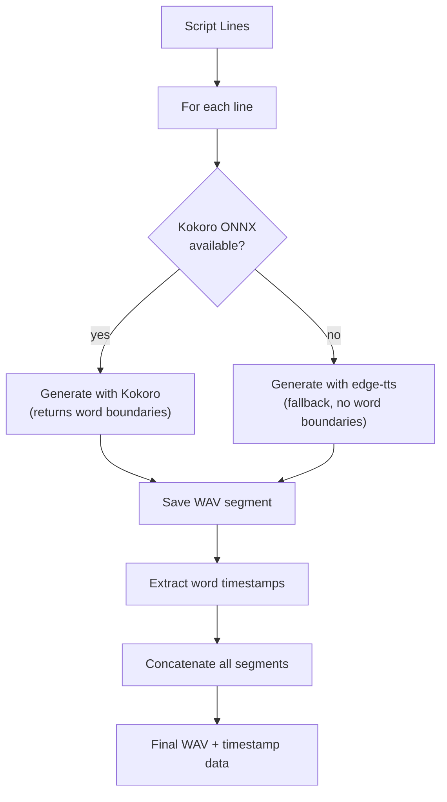

**Kokoro ONNX Integration:**
- Model files stored at `models/kokoro/`
- Runs entirely locally — no API calls, no latency, no cost
- Returns word-boundary timestamps directly from the inference output
- Each word gets: `{ "word": str, "start": float, "end": float }`
- Supports multiple voice styles mapped to characters

**edge-tts Fallback:**
- Used when Kokoro model files are missing or inference fails
- Microsoft Edge's online TTS service
- Returns audio as MP3 (converted to WAV for FFmpeg compatibility)
- Word-level timestamps extracted via SSML metadata events

**Audio Concatenation:**
- All per-line WAV segments concatenated into a single file
- Small silence gap (~200ms) inserted between lines for natural pacing
- Final file saved to `assets/temp/combined_audio.wav`

**Key Design Decisions:**
- **Kokoro ONNX as primary:** Eliminates API costs and latency. A single video's TTS would cost ~$0.02 on cloud services — trivial per video but significant at scale across users. Local inference runs in ~2s for a full script.
- **Word-level timestamps:** Critical for the subtitle system. Without word-level timing, subtitles would display entire lines at once (boring). Word-by-word highlighting creates the kinetic text effect that performs well on Shorts.
- **WAV format:** FFmpeg handles WAV natively without codec negotiation. MP3 requires additional decoding overhead and can introduce timing drift in concatenation.

---

### Node 5: Video Assembler (`agent/nodes/video_assembler.py`)

**Purpose:** Assemble the final 1080×1920 vertical video from all collected assets using a two-pass FFmpeg pipeline.

**Inputs (from state):**
| Key | Type | Source |
|---|---|---|
| `character_a_image` | `str` | Node 3 |
| `character_b_image` | `str` | Node 3 |
| `audio_path` | `str` | Node 4 |
| `word_timestamps` | `list[dict]` | Node 4 |
| `total_duration` | `float` | Node 4 |
| `script` | `list[dict]` | Node 2 |

**Outputs (written to state):**
| Key | Type | Description |
|---|---|---|
| `video_path` | `str` | Path to final MP4 |
| `subtitle_path` | `str` | Path to generated .ass file |

**This is the most complex node in the pipeline.** It performs three major operations:

#### Step 1: Generate .ass Subtitle File

The node generates an Advanced SubStation Alpha (.ass) subtitle file from word-level timestamps:

```
[Script Info]
Title: Cronus Subtitles
ScriptType: v4.00+
PlayResX: 1080
PlayResY: 1920

[V4+ Styles]
Style: Default,Inter Bold,48,&H00FFFFFF,&H000000FF,&H00000000,&H80000000,-1,0,0,0,100,100,0,0,1,3,0,2,10,10,40,1

[Events]
Dialogue: 0,0:00:01.20,0:00:01.50,Default,,0,0,0,,{\c&H0022FF&}word1
Dialogue: 0,0:00:01.50,0:00:01.80,Default,,0,0,0,,{\c&H00F5F5F5&}word2
```

**Subtitle Styling:**
- Font: Inter Bold, 48pt
- Current word: Highlighted in cronus-red (`#FF2200` → ASS format `&H0022FF&`)
- Other words: White (`#F5F5F5`)
- Black outline (3px) for readability over gameplay backgrounds
- Positioned at bottom-center of 1080×1920 frame

#### Step 2: FFmpeg Pass 1 — Base Video Assembly

```bash
ffmpeg -y \
  -stream_loop -1 -i "assets/backgrounds/gameplay.mp4" \
  -i "assets/temp/combined_audio.wav" \
  -i "character_a.png" \
  -i "character_b.png" \
  -filter_complex "
    [0:v]scale=1080:1920:force_original_aspect_ratio=increase,
         crop=1080:1920,setsar=1[bg];
    [2:v]scale=400:-1[ca];
    [3:v]scale=400:-1[cb];
    [bg][ca]overlay=50:800[tmp];
    [tmp][cb]overlay=630:800[out]
  " \
  -map "[out]" -map 1:a \
  -c:v libx264 -preset fast -crf 23 \
  -c:a aac -b:a 128k \
  -t {total_duration} \
  -shortest \
  "assets/temp/pass1.mp4"
```

**What this does:**
- Loops the background gameplay video to match audio duration
- Scales and crops background to exactly 1080×1920 (vertical)
- Overlays character A image at position (50, 800) — left side
- Overlays character B image at position (630, 800) — right side
- Maps the concatenated audio as the audio track
- Encodes as H.264 with CRF 23 (good quality/size balance)
- Trims to exact audio duration

#### Step 3: FFmpeg Pass 2 — Subtitle Burn

```bash
ffmpeg -y \
  -i "assets/temp/pass1.mp4" \
  -vf "ass=assets/temp/subtitles.ass" \
  -c:v libx264 -preset fast -crf 23 \
  -c:a copy \
  "output/{run_id}.mp4"
```

**What this does:**
- Takes the Pass 1 output as input
- Burns the .ass subtitle file directly into the video frames (hardcoded, not a subtitle track)
- Re-encodes video (required for filter application) but copies audio stream
- Outputs final MP4 to `output/` directory

**Output Specifications:**
| Property | Value |
|---|---|
| Resolution | 1080 × 1920 (9:16 vertical) |
| Frame Rate | 30 fps |
| Video Codec | H.264 (libx264) |
| Audio Codec | AAC 128kbps |
| Average File Size | ~45 MB |
| Duration | 30-50 seconds |

**Key Design Decisions:**
- **Two-pass encoding:** Burning subtitles requires a video filter, which forces re-encoding. Doing overlays and subtitles in a single pass would create an extremely complex filter graph. Two passes keep each step debuggable.
- **Hardcoded subtitles (burn) vs. subtitle track:** YouTube Shorts doesn't support external subtitle tracks. Burnt-in subtitles are the only option for word-by-word highlighting.
- **CRF 23:** Empirically tested sweet spot. CRF 18 produces ~80 MB files (wasteful for Shorts). CRF 28 shows visible quality loss on text rendering. CRF 23 gives clean subtitle text at ~45 MB.
- **libass for .ass format:** ASS format supports per-word color overrides, precise positioning, and custom fonts — features not available in SRT format. This is what enables the word-by-word highlighting effect.

---

### Node 6: Metadata Generator (`agent/nodes/metadata_generator.py`)

**Purpose:** Generate YouTube-optimized metadata (title, description, tags, hashtags) using Gemini Flash.

**Inputs (from state):**
| Key | Type | Source |
|---|---|---|
| `topic` | `str` | Node 1 |
| `script` | `list[dict]` | Node 2 |
| `character_a` | `str` | Node 1 |
| `character_b` | `str` | Node 1 |

**Outputs (written to state):**
| Key | Type | Description |
|---|---|---|
| `title` | `str` | YouTube title (< 60 chars, includes emojis) |
| `description` | `str` | YouTube description with hashtags |
| `tags` | `list[str]` | SEO tags (10-15 tags) |
| `hashtags` | `list[str]` | Hashtags for description (`#Shorts` always included) |

**Pydantic Validation Model:**
```python
class MetadataOutput(BaseModel):
    """Validated metadata output from Gemini."""
    title: str            # Must be < 60 characters
    description: str      # Multi-line description
    tags: list[str]       # 10-15 relevant tags
    hashtags: list[str]   # Always includes #Shorts
```

**Prompt Strategy:**
- Gemini receives the topic and full script as context
- Instructed to create clickbait-style titles with emojis
- Tags optimized for YouTube search discovery
- `#Shorts` hashtag always included (signals YouTube's Shorts algorithm)
- Description includes a brief hook + character attribution + hashtags

**Key Design Decisions:**
- **AI-generated metadata vs. template:** Templates produce repetitive titles that YouTube's algorithm penalizes. AI-generated metadata is unique per video, improving discoverability.
- **60-character title limit:** YouTube truncates titles in Shorts feed at ~60 characters. Enforced via Pydantic validation + retry.

---

### Node 7: Queue Manager (`agent/nodes/queue_manager.py`)

**Purpose:** Add the completed video to the upload queue with a scheduled upload time.

**Inputs (from state):**
| Key | Type | Source |
|---|---|---|
| `video_path` | `str` | Node 5 |
| `title` | `str` | Node 6 |
| `description` | `str` | Node 6 |
| `tags` | `list[str]` | Node 6 |
| `run_id` | `str` | Node 1 |
| `config` | `dict` | Initial state |

**Outputs (written to state):**
| Key | Type | Description |
|---|---|---|
| `queue_entry` | `dict` | The queue record that was created |
| `scheduled_upload_time` | `str` | ISO 8601 scheduled time |

**Queue Entry Schema:**
```json
{
  "run_id": "uuid-string",
  "user_id": "supabase-user-uuid",
  "video_path": "output/uuid-string.mp4",
  "title": "When GPT Explains Recursion to Gojo 🤯",
  "description": "...",
  "tags": ["tech", "anime", "shorts"],
  "status": "pending",
  "scheduled_upload_time": "2026-05-29T10:00:00Z",
  "created_at": "2026-05-28T01:15:00Z"
}
```

**Dual Write (current state):**
- Writes to `queue.json` (legacy, for local mode)
- Writes to Supabase `videos` table via `sync_video_to_supabase()` (SaaS mode)
- Uses `filelock` to prevent concurrent writes to `queue.json`

**Schedule Calculation:**
- Reads user's configured upload times from config
- Finds the next available slot that's in the future
- Accounts for timezone (stored in user config)

**Key Design Decisions:**
- **Dual write during migration:** The system currently writes to both `queue.json` and Supabase. This is intentional — it allows the local mode to continue working while the SaaS mode is being stabilized. Phase 3 will eliminate `queue.json` entirely.
- **Filelock on queue.json:** In multi-process execution (master scheduler), multiple pipeline instances could try to write to `queue.json` simultaneously. `filelock` prevents corruption.

---

## 7. State Management — VideoState

The `VideoState` TypedDict in `agent/state.py` is the spine of the entire system. It flows through every node, accumulating data as the pipeline progresses.

```python
from typing import TypedDict, Optional

class VideoState(TypedDict, total=False):
    """Complete state for a single video generation run.

    This dict flows through all 7 nodes. Each node reads its required
    keys and writes its output keys. The 'error' key short-circuits
    the pipeline via conditional edges.
    """

    # ── Run Identity ──
    run_id: str                       # UUID for this pipeline run
    user_id: Optional[str]            # Supabase user ID (None in local mode)

    # ── Configuration ──
    config: dict                      # Full config (from YAML or Supabase)

    # ── Node 1: Idea Generator ──
    topic: str                        # Selected trending topic
    character_a: str                  # Character A name
    character_b: str                  # Character B name
    character_a_role: str             # "explainer" or "confused"
    character_b_role: str             # "explainer" or "confused"

    # ── Node 2: Script Writer ──
    script: list                      # List of ScriptLine dicts
    script_raw: str                   # Raw JSON from Gemini

    # ── Node 3: Image Picker ──
    character_a_image: str            # Absolute path to image file
    character_b_image: str            # Absolute path to image file

    # ── Node 4: Asset Fetcher ──
    audio_path: str                   # Path to concatenated WAV
    audio_segments: list              # Per-line audio metadata
    word_timestamps: list             # Word-level timing for subtitles
    total_duration: float             # Total audio duration (seconds)

    # ── Node 5: Video Assembler ──
    video_path: str                   # Path to final MP4
    subtitle_path: str                # Path to .ass subtitle file

    # ── Node 6: Metadata Generator ──
    title: str                        # YouTube title
    description: str                  # YouTube description
    tags: list                        # SEO tags
    hashtags: list                    # Hashtags (#Shorts, etc.)

    # ── Node 7: Queue Manager ──
    queue_entry: dict                 # Queue record
    scheduled_upload_time: str        # ISO 8601 scheduled time

    # ── Error Handling ──
    error: Optional[str]              # If set, pipeline short-circuits to END

    # ── Telemetry ──
    node_timings: dict                # { "node_name": duration_seconds }
    started_at: str                   # ISO 8601 pipeline start time
    completed_at: Optional[str]       # ISO 8601 pipeline end time
```

### State Validation

Each node validates its required input keys before execution:

```python
def validate_state_for_node(state: dict, node_name: str) -> Optional[str]:
    """Validate that required state keys exist for a given node.

    Returns an error message if validation fails, None if valid.
    """
    required_keys = {
        "idea_generator": ["config"],
        "script_writer": ["topic", "character_a", "character_b"],
        "image_picker": ["character_a", "character_b"],
        "asset_fetcher": ["script", "character_a", "character_b"],
        "video_assembler": [
            "character_a_image", "character_b_image",
            "audio_path", "word_timestamps", "total_duration",
        ],
        "metadata_generator": ["topic", "script", "character_a", "character_b"],
        "queue_manager": ["video_path", "title", "description", "tags", "run_id"],
    }

    for key in required_keys.get(node_name, []):
        if key not in state or state[key] is None:
            return f"Missing required state key '{key}' for node '{node_name}'"
    return None
```

---

## 8. Supabase Database Schema

### Entity-Relationship Diagram

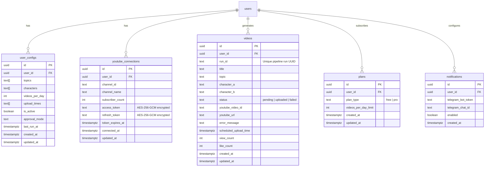

### Table Details

#### `user_configs`

Stores the per-user pipeline configuration that maps directly to the `config` dict consumed by the pipeline.

| Column | Type | Constraints | Description |
|---|---|---|---|
| `id` | `uuid` | PK, default `gen_random_uuid()` | Row ID |
| `user_id` | `uuid` | FK → `auth.users(id)`, UNIQUE | Owning user |
| `topics` | `text[]` | NOT NULL, default `'{}'` | List of preferred topics |
| `characters` | `text[]` | NOT NULL, default `'{}'` | List of selected characters |
| `videos_per_day` | `integer` | NOT NULL, default `1` | Videos to generate daily |
| `upload_times` | `text[]` | NOT NULL, default `'{"10:00"}'` | Preferred upload times (HH:MM) |
| `is_active` | `boolean` | NOT NULL, default `false` | Whether the agent should run |
| `approval_mode` | `text` | default `'auto'` | `'auto'` or `'manual'` |
| `last_run_at` | `timestamptz` | nullable | Timestamp of last pipeline run |
| `created_at` | `timestamptz` | default `now()` | Row creation time |
| `updated_at` | `timestamptz` | default `now()` | Last modification time |

**RLS Policy:** Users can only read/write their own row (`auth.uid() = user_id`).

#### `youtube_connections`

Stores encrypted YouTube OAuth credentials.

| Column | Type | Constraints | Description |
|---|---|---|---|
| `id` | `uuid` | PK | Row ID |
| `user_id` | `uuid` | FK, UNIQUE | Owning user |
| `channel_id` | `text` | NOT NULL | YouTube channel ID |
| `channel_name` | `text` | | Display name |
| `subscriber_count` | `integer` | | Last known subscriber count |
| `access_token` | `text` | NOT NULL | AES-256-GCM encrypted |
| `refresh_token` | `text` | NOT NULL | AES-256-GCM encrypted |
| `token_expires_at` | `timestamptz` | | Token expiration time |
| `connected_at` | `timestamptz` | | When OAuth was completed |
| `updated_at` | `timestamptz` | | Last token refresh |

**Security:** Tokens are never stored in plaintext. See [Section 9: Security & Encryption](#9-security--encryption).

#### `videos`

The canonical record of every video the system generates.

| Column | Type | Constraints | Description |
|---|---|---|---|
| `id` | `uuid` | PK | Row ID |
| `user_id` | `uuid` | FK | Owning user |
| `run_id` | `text` | UNIQUE | Pipeline run UUID |
| `title` | `text` | | YouTube title |
| `topic` | `text` | | Generated topic |
| `character_a` | `text` | | Character A name |
| `character_b` | `text` | | Character B name |
| `status` | `text` | NOT NULL, default `'pending'` | `pending` / `uploaded` / `failed` |
| `youtube_video_id` | `text` | | YouTube's video ID (after upload) |
| `youtube_url` | `text` | | Full YouTube URL (after upload) |
| `error_message` | `text` | | Error details (if failed) |
| `scheduled_upload_time` | `timestamptz` | | When upload is scheduled |
| `view_count` | `integer` | default `0` | YouTube view count (future) |
| `like_count` | `integer` | default `0` | YouTube like count (future) |
| `created_at` | `timestamptz` | | Generation time |
| `updated_at` | `timestamptz` | | Last status update |

**Status Lifecycle:**
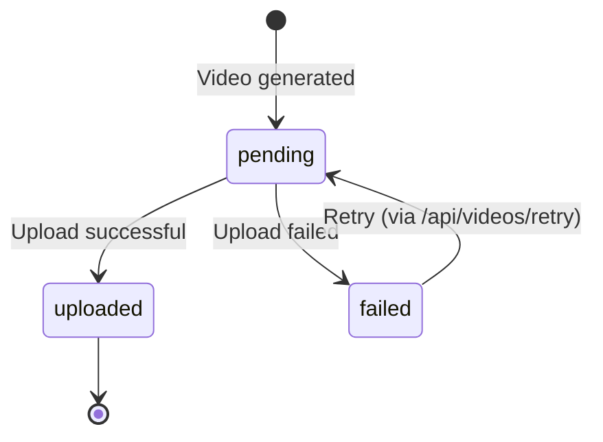

#### `plans`

| Column | Type | Description |
|---|---|---|
| `id` | `uuid` | Row ID |
| `user_id` | `uuid` | FK, UNIQUE |
| `plan_type` | `text` | `'free'` or `'pro'` |
| `videos_per_day_limit` | `integer` | 1 (free) or 3 (pro) |

#### `notifications`

| Column | Type | Description |
|---|---|---|
| `id` | `uuid` | Row ID |
| `user_id` | `uuid` | FK, UNIQUE |
| `telegram_bot_token` | `text` | Telegram Bot API token |
| `telegram_chat_id` | `text` | Telegram chat/group ID |
| `enabled` | `boolean` | Toggle notifications on/off |

---

## 9. Security & Encryption

### OAuth Token Encryption (AES-256-GCM)

YouTube OAuth tokens (`access_token`, `refresh_token`) are encrypted at rest in Supabase using AES-256-GCM authenticated encryption.

#### Encryption Flow (Frontend → Supabase)

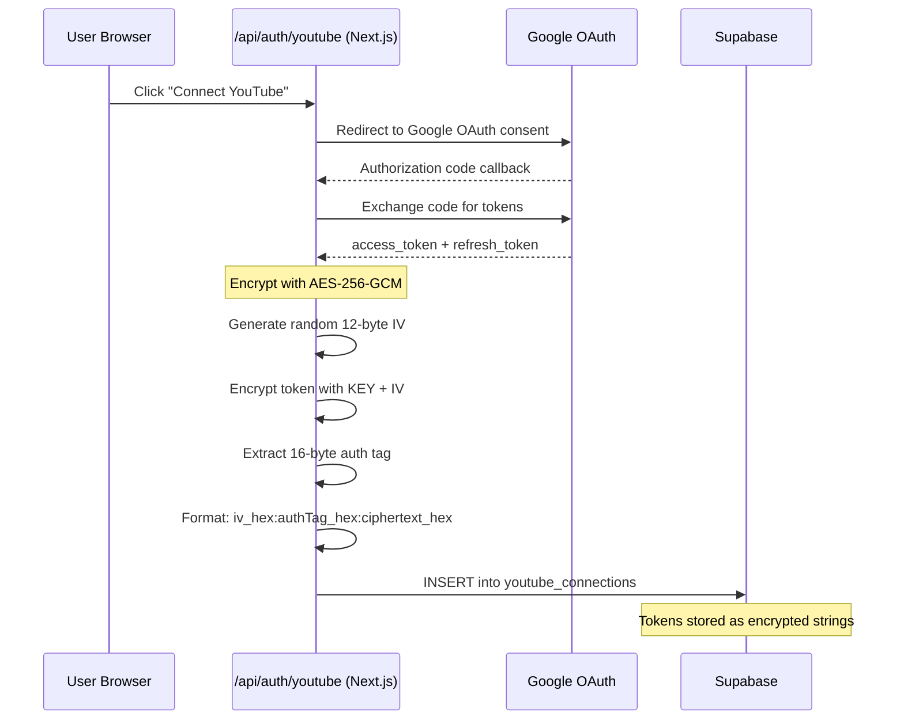

#### Encryption Implementation (Node.js — Frontend)

```typescript
import crypto from 'crypto';

function encryptToken(plaintext: string): string {
  /**
   * Encrypt a token string using AES-256-GCM.
   *
   * Returns format: iv_hex:authTag_hex:ciphertext_hex
   */
  const key = Buffer.from(process.env.TOKEN_ENCRYPTION_KEY!, 'hex');
  const iv = crypto.randomBytes(12);
  const cipher = crypto.createCipheriv('aes-256-gcm', key, iv);

  let encrypted = cipher.update(plaintext, 'utf8', 'hex');
  encrypted += cipher.final('hex');
  const authTag = cipher.getAuthTag().toString('hex');

  return `${iv.toString('hex')}:${authTag}:${encrypted}`;
}
```

#### Decryption Implementation (Python — Backend)

```python
from cryptography.hazmat.primitives.ciphers.aead import AESGCM
import os

def decrypt_token(encrypted_string: str) -> str:
    """Decrypt an AES-256-GCM encrypted token.

    Input format: iv_hex:authTag_hex:ciphertext_hex
    """
    key = bytes.fromhex(os.environ["TOKEN_ENCRYPTION_KEY"])
    iv_hex, auth_tag_hex, ciphertext_hex = encrypted_string.split(":")

    iv = bytes.fromhex(iv_hex)
    auth_tag = bytes.fromhex(auth_tag_hex)
    ciphertext = bytes.fromhex(ciphertext_hex)

    aesgcm = AESGCM(key)
    plaintext = aesgcm.decrypt(iv, ciphertext + auth_tag, None)
    return plaintext.decode("utf-8")
```

#### Security Properties

| Property | Guarantee |
|---|---|
| **Confidentiality** | AES-256 encryption — 256-bit key space |
| **Integrity** | GCM auth tag detects tampering |
| **Freshness** | Random 12-byte IV per encryption (no IV reuse) |
| **Key Management** | Key stored as env var, never in code or DB |
| **Cross-platform** | Same key used by Node.js (frontend) and Python (backend) |

#### Token Expiry Management

Google OAuth tokens issued during testing mode have a **7-day expiration** (Google's limitation for unverified apps). The frontend implements a token expiry warning system:

| Condition | UI Treatment |
|---|---|
| Token expires in > 24 hours | No banner shown |
| Token expires within 24 hours | Yellow warning banner |
| Token expired | Red error banner with "Reconnect" button |
| No YouTube connected | Onboarding prompt |

The banner is rendered on the dashboard and settings pages, prompting the user to re-authenticate before their upload capability is disrupted.

---

## 10. Supabase Bridge (SaaS Adapter)

`agent/supabase_bridge.py` is the critical adapter layer that enables the Python pipeline to operate in multi-tenant SaaS mode by interfacing with Supabase.

### Function Reference

#### `get_supabase_client() -> Client`
```python
def get_supabase_client() -> Client:
    """Create a Supabase client with service role key.

    Uses the service role key to bypass Row Level Security (RLS),
    allowing the backend to read/write any user's data.
    """
```
**Design Decision:** The backend uses the **service role key** (not the anon key) because it needs to access data for any user during scheduled pipeline runs. RLS policies are enforced at the frontend level; the backend is a trusted server-side process.

#### `fetch_user_config(user_id: str) -> dict`
```python
def fetch_user_config(user_id: str) -> dict:
    """Fetch user configuration from Supabase and transform to pipeline format.

    Reads from the `user_configs` table and maps the column structure
    to the exact dict format expected by the pipeline (matching config.yaml).

    Returns a dict identical in structure to what config.py would parse
    from a local YAML file, ensuring zero code changes in the pipeline nodes.
    """
```
**Design Decision:** The bridge transforms Supabase rows into the same dict format as `config.yaml` so that all 7 pipeline nodes work identically in both local and SaaS mode. No node code needed modification for the SaaS migration.

#### `fetch_youtube_credentials(user_id: str) -> dict`
```python
def fetch_youtube_credentials(user_id: str) -> dict:
    """Fetch and decrypt YouTube OAuth credentials for a user.

    Reads encrypted tokens from youtube_connections table,
    decrypts using AES-256-GCM, and returns a credentials dict
    compatible with google-auth library.
    """
```

#### `sync_video_to_supabase(user_id: str, state: dict, status: str) -> None`
```python
def sync_video_to_supabase(
    user_id: str,
    state: dict,
    status: str = "pending",
) -> None:
    """Upsert a video record into the Supabase videos table.

    Called by Node 7 (queue_manager) after successful pipeline completion.
    Uses run_id as the unique key for upsert to handle retries gracefully.
    """
```

#### `update_video_status(run_id: str, status: str, **kwargs) -> None`
```python
def update_video_status(
    run_id: str,
    status: str,
    youtube_video_id: str | None = None,
    youtube_url: str | None = None,
    error_message: str | None = None,
) -> None:
    """Update a video's status after upload attempt.

    Called by the uploader after each upload attempt.
    On success: status='uploaded', youtube_video_id and youtube_url set.
    On failure: status='failed', error_message set.
    """
```

#### `mark_agent_active(user_id: str, active: bool) -> None`
```python
def mark_agent_active(user_id: str, active: bool) -> None:
    """Toggle the agent's active status for a user.

    Called at pipeline start (active=True) and end (active=False).
    The dashboard polls this to show real-time agent status.
    """
```

---

## 11. Master Scheduler

`master_scheduler.py` is the 24/7 orchestration daemon that drives the entire SaaS platform.

### Architecture

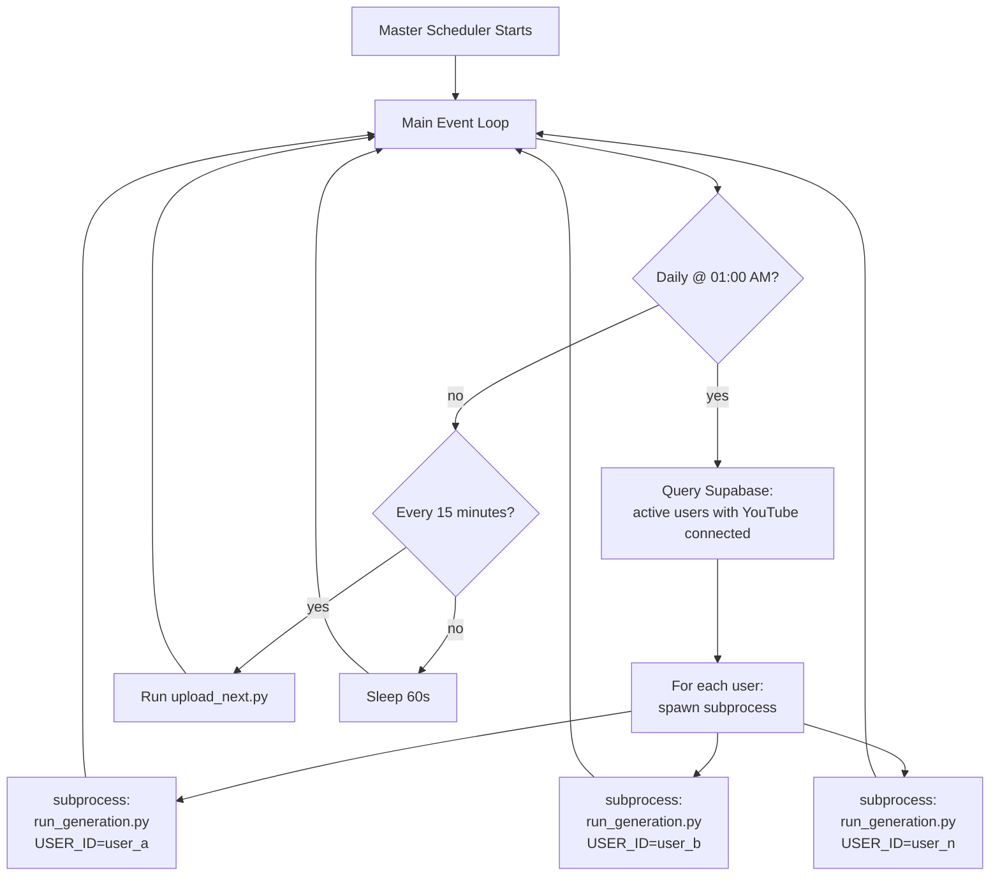

### Key Behaviors

1. **Daily Generation (01:00 AM):**
   - Queries Supabase for all users where `is_active = true` AND `youtube_connections` exists
   - Launches `run_generation.py` as an **isolated subprocess** per user
   - Each subprocess receives `USER_ID` as an environment variable
   - Subprocesses run in parallel but are independent — no shared state

2. **Upload Polling (every 15 minutes):**
   - Runs `upload_next.py` which queries the upload queue for the next pending video
   - Processes one video per cycle to avoid rate-limiting
   - Handles both Supabase-sourced queue entries and legacy `queue.json` entries

3. **Process Isolation:**
   - Each user's pipeline runs in a **separate process** to prevent LangGraph state bleed
   - If one user's pipeline crashes, it doesn't affect other users
   - Logs are written per-user to `logs/{user_id}/`

### Design Decisions

- **01:00 AM generation time:** Most YouTube Shorts traffic in the tech niche peaks between 8 AM - 12 PM. Generating at 1 AM gives a comfortable buffer for the pipeline to complete and queue uploads for morning slots.
- **15-minute upload interval:** YouTube's API rate limit allows ~6 uploads per hour per channel. 15-minute intervals ensure we never exceed this, even with multiple users.
- **Subprocess over threading:** Python's GIL makes threading unsuitable for CPU-bound work (FFmpeg, ONNX inference). Subprocesses provide true parallelism and memory isolation.

---

## 12. Uploader System

### `uploader/upload_next.py`

The uploader is a standalone script that processes the next pending video from the queue.

#### Credential Loading Flow

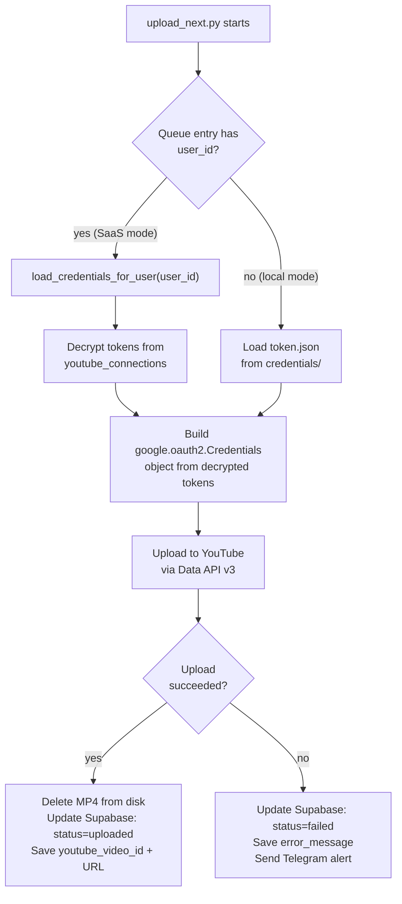

### `uploader/youtube_upload.py`

Core upload function with retry logic:

```python
@retry(
    stop=stop_after_attempt(3),
    wait=wait_exponential(multiplier=1, min=4, max=30),
    retry=retry_if_exception_type(HttpError),
)
def upload_video(
    credentials: Credentials,
    video_path: str,
    title: str,
    description: str,
    tags: list[str],
    category_id: str = "28",      # Science & Technology
    privacy_status: str = "public",
) -> dict:
    """Upload a video to YouTube via the Data API v3.

    Returns dict with 'id' (video ID) and 'url' (watch URL).
    Retries up to 3 times with exponential backoff on HTTP errors.
    """
```

**Upload Parameters:**
| Parameter | Value | Rationale |
|---|---|---|
| `category_id` | `28` (Science & Technology) | Best match for tech content |
| `privacy_status` | `public` | Shorts need to be public for algorithm pickup |
| `made_for_kids` | `False` | Anime characters + slang → not kid content |
| `shorts_remixing_type` | `"shorts"` | Signals to YouTube this is a Short |

**Post-Upload Actions:**
1. **On success:** Delete the local `.mp4` file to free disk space. Update Supabase `videos` table with `status='uploaded'`, `youtube_video_id`, and `youtube_url`.
2. **On failure:** Update Supabase with `status='failed'` and `error_message`. Send a Telegram alert to the user (if configured).

---

## 13. Frontend Dashboard (cronus-web)

### Page Map

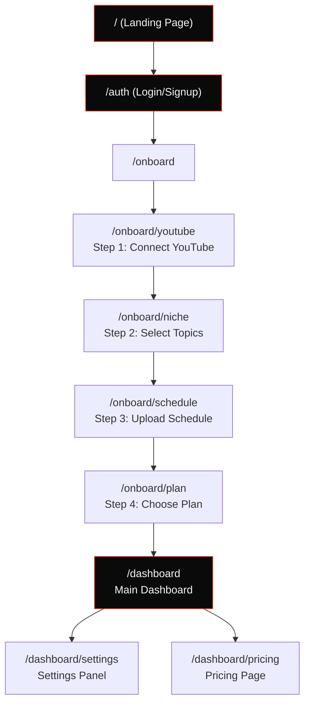

### Landing Page (`/`)

The landing page uses the brutalist Cronus design system. Key elements:
- Full-screen hero with animated gradient background
- "Cronus" wordmark in uppercase monospace
- Feature highlights with red accent borders
- CTA button linking to auth

### Authentication (`/auth`)

Supabase Auth integration:
- Email/password sign-up and login
- Session management via `@supabase/ssr` (cookie-based)
- Protected routes redirect to `/auth` if no session
- Post-auth redirect to `/onboard` (first time) or `/dashboard` (returning)

### Onboarding Wizard (`/onboard/*`)

A 4-step linear wizard that configures a new user's pipeline:

| Step | Route | What It Does |
|---|---|---|
| 1 | `/onboard/youtube` | Initiates Google OAuth flow. On callback, encrypts tokens and stores in `youtube_connections`. Shows channel name + subscriber count on success. |
| 2 | `/onboard/niche` | Multi-select grid of topic categories (AI, Web Dev, Cybersecurity, etc.). Saves to `user_configs.topics`. |
| 3 | `/onboard/schedule` | Time picker for upload slots. Saves to `user_configs.upload_times`. Defaults to 10:00 AM. |
| 4 | `/onboard/plan` | Pricing cards (Free vs Pro). Saves to `plans` table. Currently no payment integration — Pro is unlocked manually. |

### Dashboard (`/dashboard`)

The main operational view:

**Stats Row (top):**
- Total Videos Generated (count from `videos` table)
- Successfully Uploaded (count where `status='uploaded'`)
- Agent Status (live indicator: active/idle, from `user_configs.is_active`)

**Pending Queue (middle):**
- Cards for each video with `status='pending'`
- Shows title, topic, characters, scheduled upload time
- (Planned: Cancel/Retry buttons)

**Recent History (bottom):**
- Table of last 20 videos
- Columns: Title, Topic, Status, YouTube Link, Created At
- Status badges: green (uploaded), yellow (pending), red (failed)
- Failed videos show error message on hover

**Token Expiry Banner (conditional):**
- Yellow/Red banner at top of dashboard when YouTube OAuth token is approaching expiry
- "Reconnect" button that re-initiates the OAuth flow

### Settings (`/dashboard/settings`)

5 configuration sections + danger zone:

| Section | Controls |
|---|---|
| **YouTube Connection** | Connected channel info, disconnect button, reconnect button |
| **Upload Schedule** | Add/remove upload time slots, timezone selector |
| **Topics** | Add/remove topic preferences with tag-style UI |
| **Characters** | Character selection grid with avatar previews |
| **Notifications** | Telegram bot token + chat ID input fields |
| **⚠️ Danger Zone** | Delete account, disconnect YouTube, reset all settings |

All settings changes are saved via API routes to Supabase in real-time.

### Pricing (`/dashboard/pricing`)

| Feature | Free | Pro |
|---|---|---|
| Videos per day | 1 | 3 |
| Characters | 3 | All |
| Custom topics | 5 | Unlimited |
| Upload scheduling | ✓ | ✓ |
| Priority generation | — | ✓ |
| Price | $0 | TBD |

### API Routes

| Route | Method | Description |
|---|---|---|
| `/api/auth/youtube` | `GET` | OAuth callback handler. Exchanges code for tokens, encrypts, stores. |
| `/api/configs/update` | `POST` | Update user configuration (topics, schedule, characters). |
| `/api/plans` | `POST` | Update user's plan type. |
| `/api/videos/retry` | `POST` | Reset a failed video's status to `'pending'` for re-upload. |
| `/api/notifications` | `POST` | Update Telegram notification settings. |
| `/api/agent/status` | `GET` | Returns current agent status for the authenticated user. |

---

## 14. Design System

### Cronus — Brutalist Dark Theme

The design system is a custom brutalist dark theme inspired by terminal aesthetics and anti-design movements.

#### Color Palette

| Token | Hex | Usage |
|---|---|---|
| `cronus-bg` | `#0A0A0A` | Page background |
| `cronus-surface` | `#141414` | Cards, panels, inputs |
| `cronus-white` | `#F5F5F5` | Primary text |
| `cronus-gray` | `#6B6B6B` | Secondary text, borders |
| `cronus-red` | `#FF2200` | Accent, CTAs, highlights, errors |

#### Typography

| Token | Font | Usage |
|---|---|---|
| `font-sans` | Inter | Body text, descriptions |
| `font-mono` | JetBrains Mono | Labels, stats, code, headings |

#### Design Principles

1. **Sharp borders, no rounded corners:** All elements use `border-radius: 0`. This is a deliberate brutalist choice — rounded corners feel "friendly" and "soft", which contradicts the Cronus aesthetic.

2. **Neo-brutalist shadows:** `shadow-[4px_4px_0px_0px]` applied to cards and buttons. Hard-offset shadows instead of soft drop shadows reinforce the brutalist feel.

3. **Uppercase monospace labels:** All section headers and labels are rendered in uppercase JetBrains Mono. This creates a terminal/HUD aesthetic.

4. **Red accent everywhere:** `#FF2200` is used for:
   - CTA buttons
   - Active state indicators
   - Border accents on cards
   - Hover states
   - Error messages (double-duty)

5. **Minimal color palette:** Only 5 colors total. The extreme constraint forces visual consistency and prevents the "startup SaaS" look of rainbow color palettes.

#### TailwindCSS Configuration

```javascript
// tailwind.config.js (relevant excerpt)
module.exports = {
  theme: {
    extend: {
      colors: {
        'cronus-bg': '#0A0A0A',
        'cronus-surface': '#141414',
        'cronus-white': '#F5F5F5',
        'cronus-gray': '#6B6B6B',
        'cronus-red': '#FF2200',
      },
      fontFamily: {
        sans: ['Inter', 'sans-serif'],
        mono: ['JetBrains Mono', 'monospace'],
      },
      boxShadow: {
        brutal: '4px 4px 0px 0px rgba(255, 34, 0, 1)',
        'brutal-sm': '2px 2px 0px 0px rgba(255, 34, 0, 1)',
      },
      borderRadius: {
        none: '0px',  // enforce globally
      },
    },
  },
};
```

---

## 15. Environment Variables

### Python Backend (`.env`)

| Variable | Description | Example |
|---|---|---|
| `GEMINI_API_KEY` | Google Gemini Flash API key | `AIza...` |
| `TELEGRAM_BOT_TOKEN` | Telegram Bot API token for alerts | `123456:ABC-DEF...` |
| `TELEGRAM_CHAT_ID` | Telegram chat/group ID | `-100123456789` |
| `SUPABASE_URL` | Supabase project URL | `https://xxx.supabase.co` |
| `SUPABASE_SERVICE_ROLE_KEY` | Supabase service role key (bypasses RLS) | `eyJ...` |
| `TOKEN_ENCRYPTION_KEY` | 32-byte hex key for AES-256-GCM | `64-char hex string` |
| `USER_ID` | Set by master scheduler per subprocess | `uuid` |

### Frontend (`.env.local`)

| Variable | Description | Example |
|---|---|---|
| `NEXT_PUBLIC_SUPABASE_URL` | Supabase project URL (public) | `https://xxx.supabase.co` |
| `NEXT_PUBLIC_SUPABASE_ANON_KEY` | Supabase anonymous key (public) | `eyJ...` |
| `SUPABASE_SERVICE_ROLE_KEY` | Service role key (server-side only) | `eyJ...` |
| `YOUTUBE_CLIENT_ID` | Google OAuth client ID | `xxx.apps.googleusercontent.com` |
| `YOUTUBE_CLIENT_SECRET` | Google OAuth client secret | `GOCSPX-...` |
| `YOUTUBE_REDIRECT_URI` | OAuth callback URL | `http://localhost:3000/api/auth/youtube` |
| `TOKEN_ENCRYPTION_KEY` | Same AES-256 key as backend | `64-char hex string` |

> **Security Note:** `NEXT_PUBLIC_*` variables are exposed to the browser. All other variables are server-side only (accessible in API routes and Server Components, never sent to the client).

---

## 16. Dependencies

### Python (`requirements.txt`)

| Package | Purpose |
|---|---|
| `langgraph` | Agent orchestration — StateGraph pipeline |
| `google-genai` | Google Gemini Flash API client |
| `edge-tts` | Microsoft Edge TTS (fallback) |
| `pydantic` | Structured output validation |
| `tenacity` | Retry decorators for API calls |
| `filelock` | Concurrent file access protection |
| `httpx` | Async HTTP client |
| `rembg` | Background removal for character images |
| `Pillow` | Image processing and manipulation |
| `google-auth` | Google OAuth credential management |
| `google-auth-oauthlib` | OAuth flow helpers |
| `google-api-python-client` | YouTube Data API v3 client |
| `pytrends` | Google Trends scraping |
| `supabase` | Supabase Python client |
| `cryptography` | AES-256-GCM decryption |
| `python-dotenv` | .env file loading |
| `pyyaml` | YAML config parsing |
| `onnxruntime` | Kokoro TTS model inference |
| `numpy` | Numeric operations (TTS) |
| `scipy` | Audio processing (WAV I/O) |

### Frontend (`package.json`)

| Package | Purpose |
|---|---|
| `next` (14.2.35) | React framework (App Router) |
| `react` (18) | UI library |
| `@supabase/ssr` | Supabase SSR auth helpers |
| `@supabase/supabase-js` | Supabase client |
| `lucide-react` | Icon library |
| `tailwindcss` | Utility-first CSS |
| `typescript` | Type safety |

---

## 17. Development Phases & History

### Phase 0: Core Pipeline (Pre-Web) ✅

**Goal:** Build a working autonomous video generation and upload pipeline.

**Deliverables:**
- Complete 7-node LangGraph pipeline
- Local `config.yaml` for all settings
- Local `queue.json` for upload queue
- Local `history.json` for deduplication
- Local `token.json` for YouTube OAuth (single channel)
- FFmpeg video assembly with .ass subtitle burn
- Kokoro ONNX TTS with word-level timestamps
- YouTube upload via Data API v3

**Outcome:** Successfully generated and uploaded **16 videos** to a real YouTube channel. Pipeline runs end-to-end in under 60 seconds (excluding upload time).

### Phase 1: Web Dashboard ✅

**Goal:** Create a SaaS frontend for multi-user configuration and monitoring.

**Deliverables:**
- `cronus-web/` Next.js 14 project with Supabase Auth
- Landing page with brutalist Cronus theme
- 4-step onboarding wizard (YouTube OAuth → Topics → Schedule → Plan)
- Dashboard with stats, queue, and history views
- Settings panel with 5 configuration sections
- Pricing page (Free vs Pro tiers)
- YouTube OAuth flow with AES-256-GCM token encryption
- Token expiry warning banner system
- All settings wired to Supabase CRUD APIs

### Phase 2: Agent Bridge (SaaS Mode) ✅

**Goal:** Connect the Python pipeline to the web dashboard for multi-tenant operation.

**Deliverables:**
- `supabase_bridge.py` — adapter between pipeline and Supabase
- `run_generation.py` dual mode — reads config from Supabase or local YAML
- `upload_next.py` dual credential loading — Supabase tokens or local `token.json`
- `master_scheduler.py` — 24/7 daemon with daily generation + upload polling
- `user_id` field added to queue entries for multi-tenant support
- Historical migration: 16 videos from `history.json` → Supabase `videos` table
- Disk cleanup: MP4 files deleted after successful YouTube upload

### Phase 3: Deploy-Ready Refactor 🔄 (In Progress)

See [Section 20: Future Roadmap](#20-future-roadmap-phase-3).

### Key Git Commits (Chronological)

| Commit | Description |
|---|---|
| Initial commit | Project structure, LangGraph scaffold, state definition |
| Pipeline nodes 1-7 | Complete node implementations with tests |
| FFmpeg video assembly | 2-pass pipeline, .ass subtitle generation |
| Kokoro TTS integration | ONNX model loading, word-level timestamps |
| YouTube upload | OAuth flow, Data API v3 upload with retry |
| `cronus-web/` init | Next.js 14, Supabase Auth, landing page |
| Onboarding wizard | 4-step wizard with YouTube OAuth |
| Dashboard + Settings | Stats, queue, history, full settings panel |
| Token encryption | AES-256-GCM for OAuth tokens at rest |
| Supabase bridge | `supabase_bridge.py`, dual-mode config/credentials |
| Master scheduler | `master_scheduler.py` for multi-tenant automation |
| Token expiry banner | Yellow/red warnings for 7-day OAuth limit |
| History migration | Script to migrate `history.json` → Supabase |

---

## 18. Design Decisions & Rationale

### Why LangGraph?

| Alternative | Why Not |
|---|---|
| Raw Python functions | No state machine semantics, no conditional routing, no built-in error propagation |
| Prefect / Airflow | Overkill for a 7-step linear pipeline; designed for DAG scheduling, not agent state machines |
| LangChain only | LangChain's `SequentialChain` doesn't support conditional edges or typed state |
| Custom state machine | Reinventing the wheel — LangGraph provides exactly the StateGraph primitive we need |

**LangGraph was chosen because:**
1. It provides a `StateGraph` with conditional edges — perfect for error short-circuiting
2. Each node naturally maps to a pipeline step
3. State is a simple TypedDict — no framework lock-in on the data layer
4. It's from the LangChain ecosystem, well-maintained and documented

### Why Gemini Flash (not GPT-4, Claude, etc.)?

| Factor | Gemini Flash | GPT-4 | Claude |
|---|---|---|---|
| **Cost** | Free tier available | ~$0.03/script | ~$0.05/script |
| **Speed** | ~1.5s per call | ~3-5s per call | ~2-3s per call |
| **JSON output** | Native JSON mode | Native JSON mode | Native JSON mode |
| **Quality for this task** | Sufficient | Overkill | Overkill |

For generating brainrot dialogue scripts and YouTube metadata, Gemini Flash provides more than adequate quality at zero cost. The scripts don't require reasoning depth — they require creativity and format compliance, both of which Flash handles well.

### Why Kokoro ONNX (not ElevenLabs, Google Cloud TTS)?

| Factor | Kokoro ONNX | ElevenLabs | Google Cloud TTS |
|---|---|---|---|
| **Cost** | Free (local) | ~$0.30/min | ~$0.016/min |
| **Latency** | ~2s total | ~5s per line | ~3s per line |
| **Word timestamps** | Native output | API feature | Not available |
| **Quality** | Good enough | Premium | Good |
| **Privacy** | Fully offline | Cloud | Cloud |

Kokoro was chosen because it runs locally (zero cost at scale), provides word-level timestamps natively (critical for subtitle sync), and has no rate limits. The quality is sufficient for comedic anime dialogue.

### Why Two-Pass FFmpeg?

A single-pass FFmpeg command that applies overlays AND burns subtitles is possible but creates an extremely complex filter graph:
```
[bg][img1]overlay[tmp];[tmp][img2]overlay[tmp2];[tmp2]subtitles=subs.ass[out]
```

Problems with single-pass:
1. The `subtitles` filter requires the video dimensions to be finalized — but overlay can change the output geometry if not carefully constrained
2. Debugging is harder: if the output looks wrong, you can't tell if it's an overlay issue or a subtitle issue
3. ASS rendering with libass in a complex filter chain has known bugs with positioning

Two passes add ~10 seconds to the pipeline but make each step independently debuggable and reliable.

### Why Supabase (not Firebase, Planetscale, etc.)?

| Factor | Supabase | Firebase | Planetscale |
|---|---|---|---|
| **Auth** | Built-in, free tier | Built-in, free tier | None |
| **Database** | PostgreSQL (full SQL) | Firestore (NoSQL) | MySQL |
| **RLS** | Native PostgreSQL RLS | Firestore rules | Application-level |
| **Python client** | Official | Community | Official |
| **Cost** | Free tier generous | Free tier adequate | Free tier generous |

Supabase was chosen because:
1. PostgreSQL provides relational integrity (user → configs, user → videos, etc.)
2. Row Level Security is enforced at the database level, not application level
3. Built-in Auth eliminates a separate auth service
4. The free tier supports the current user base without cost

### Why Brutalist Design?

The tech content niche on YouTube Shorts is saturated with colorful, rounded, "friendly" designs. The brutalist Cronus theme:
1. **Stands out** — visually distinct from every other SaaS dashboard
2. **Matches the brand** — Cronus generates irreverent, edgy content; the UI should feel the same
3. **Reduces design complexity** — fewer decisions (no rounded corners, no gradient experimentation, no color palette debates)
4. **Performs well in dark mode** — most developers and tech-adjacent users prefer dark themes

---

## 19. Known Limitations & Tech Debt

### Critical

| Issue | Impact | Planned Fix |
|---|---|---|
| `queue.json` still in use | Dual write creates inconsistency risk | Phase 3: Eliminate, drive from Supabase only |
| `history.json` still in use | Dedup doesn't query Supabase in local mode | Phase 3: Eliminate, query `videos` table |
| Google OAuth 7-day token expiry | Users must reconnect weekly | Google app verification (long process) |
| No payment integration | Pro plan is manually unlocked | Stripe integration in Phase 3 |

### Moderate

| Issue | Impact | Notes |
|---|---|---|
| PyTrends rate limiting | Occasional fallback to static topic pool | Acceptable — fallback works well |
| Single-threaded upload processing | One video uploaded per 15-min cycle | Sufficient for current user count |
| No video preview before upload | Users can't review content | Phase 3: `needs_approval` status |
| No YouTube Analytics sync | View/like counts not populated | Phase 3: YouTube Analytics API |
| Background music not implemented | Videos have speech audio only | Low priority — many Shorts don't use BGM |

### Low

| Issue | Impact | Notes |
|---|---|---|
| No custom watermarks | All videos look identical | Phase 3: PRO-only feature |
| Scheduler.py is a placeholder | No OS-level task scheduling | Master scheduler handles this |
| No automated testing | Manual testing only | Would benefit from integration tests |
| No CI/CD pipeline | Manual deployment | Low priority until more users |

---

## 20. Future Roadmap (Phase 3)

### Planned Improvements

#### Storage Architecture
- **Eliminate `queue.json`:** Drive all upload decisions from the Supabase `videos` table where `status='pending'`
- **Eliminate `history.json`:** Query `videos` table for dedup checks instead of local file
- **Cloudflare R2:** Temporary video file staging (chosen over S3 for cost — R2 has zero egress fees). Pipeline uploads MP4 to R2 bucket, uploader downloads from R2, deletes after upload.

#### Dashboard Features
- **Retry Button:** Wire the existing `/api/videos/retry` endpoint to a UI button on failed video cards
- **YouTube Analytics:** Fetch view counts, like counts, and watch time from YouTube Analytics API. Display in dashboard stats and per-video history.
- **Preview & Approve:** New `needs_approval` video status. When `approval_mode='manual'`, videos enter this status instead of `pending`. Dashboard shows preview with Approve/Reject buttons.
- **Video Player:** Inline MP4 preview player in the dashboard (requires R2 or signed URLs)

#### Content Features
- **Custom Branding/Watermarks:** PRO-only feature. User uploads a logo/watermark image via dashboard. FFmpeg overlays it in the corner during assembly.
- **Custom Background Videos:** Allow users to upload their own gameplay/background clips
- **More Characters:** Expand the character library with community submissions

#### Business
- **Stripe Integration:** Payment processing for Pro plan
- **Usage Metering:** Track API calls and compute time per user
- **Referral System:** Affiliate links for user acquisition

---

## Appendix A: Glossary

| Term | Definition |
|---|---|
| **Brainrot** | Internet slang for content that is absurdly funny, often using memes and Gen-Z humor |
| **Brutalist Design** | Web design aesthetic characterized by raw, intentionally unpolished interfaces with sharp edges and minimal decoration |
| **CRF** | Constant Rate Factor — FFmpeg quality parameter (lower = better quality, larger file) |
| **libass** | FFmpeg's library for rendering ASS/SSA subtitle format |
| **ONNX** | Open Neural Network Exchange — model format for cross-platform ML inference |
| **RLS** | Row Level Security — PostgreSQL feature that restricts row access based on user identity |
| **Service Role Key** | Supabase admin key that bypasses all RLS policies |
| **StateGraph** | LangGraph's primary abstraction — a graph of nodes connected by edges, with shared state |

---

## Appendix B: Configuration Reference (`config.yaml`)

```yaml
# ── Topic Configuration ──
topics:
  - "Artificial Intelligence"
  - "Python Programming"
  - "Cybersecurity"
  - "Web Development"
  - "Machine Learning"
  - "JavaScript Frameworks"
  - "Cloud Computing"
  - "Open Source"

# ── Character Configuration ──
characters:
  - name: "Gojo"
    folder: "gojo"
    voice: "af_heart"           # Kokoro voice ID
  - name: "Luffy"
    folder: "luffy"
    voice: "am_adam"
  - name: "Nobita"
    folder: "nobita"
    voice: "bf_emma"

# ── Video Settings ──
video:
  resolution: "1080x1920"       # 9:16 vertical
  fps: 30
  crf: 23
  background_folder: "assets/backgrounds"
  music_folder: "assets/music"

# ── Upload Settings ──
upload:
  videos_per_day: 1
  upload_times:
    - "10:00"
    - "14:00"
    - "18:00"
  timezone: "Asia/Kolkata"

# ── API Configuration ──
gemini:
  model: "gemini-2.0-flash"
  temperature: 0.9
  max_tokens: 2048

# ── Paths ──
paths:
  output: "output/"
  temp: "assets/temp/"
  queue: "queue.json"
  history: "history.json"
  logs: "logs/"
```

---

*Document generated on 2026-05-28. For questions or updates, refer to the project repository or contact the engineering team.*
