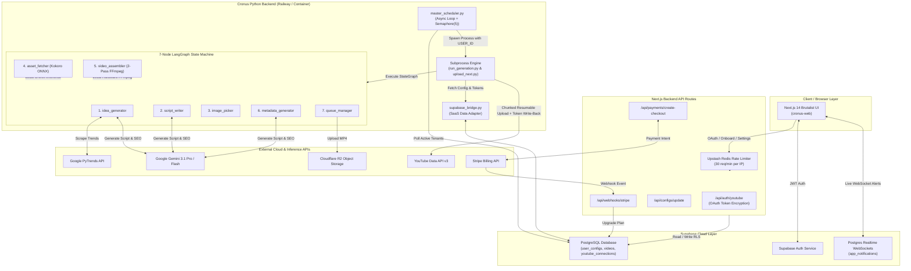
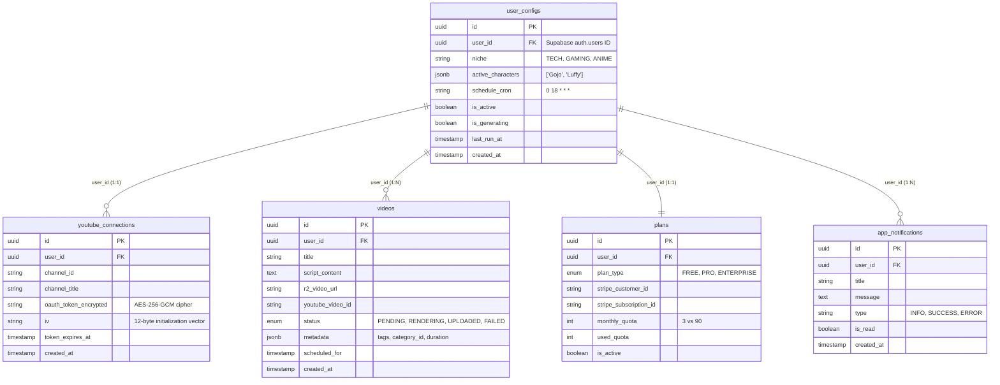

# Cronus — Autonomous AI YouTube Shorts Automation & Multi-Tenant SaaS Platform

<div align="center">


**An autonomous, multi-tenant AI video generation and scheduling engine that turns trending ideas into broadcast-quality YouTube Shorts every single day with zero human intervention.**

[](https://github.com/langchain-ai/langgraph)
[](https://nextjs.org/)
[](https://ai.google.dev/)
[](https://github.com/hexgrad/kokoro)
[](https://ffmpeg.org/)
[](https://supabase.com/)
[](https://stripe.com/)
[](https://upstash.com/)

</div>

---

## 📖 Table of Contents

1. [Platform Overview & Dual-Mode Architecture](#1-platform-overview--dual-mode-architecture)
2. [High-Level System Architecture](#2-high-level-system-architecture)
3. [The 7-Node LangGraph Pipeline (`agent/`)](#3-the-7-node-langgraph-pipeline-agent)
   - [Node 1: Idea Generator (`idea_generator.py`)](#node-1-idea-generator)
   - [Node 2: Script Writer (`script_writer.py`)](#node-2-script-writer)
   - [Node 3: Image Picker (`image_picker.py`)](#node-3-image-picker)
   - [Node 4: Asset Fetcher & TTS Engine (`asset_fetcher.py`)](#node-4-asset-fetcher--tts-engine)
   - [Node 5: Video Assembler (`video_assembler.py`)](#node-5-video-assembler)
   - [Node 6: Metadata Generator (`metadata_generator.py`)](#node-6-metadata-generator)
   - [Node 7: Queue Manager & Storage (`queue_manager.py`)](#node-7-queue-manager--storage)
4. [Multi-Tenant Scheduler & Uploader System](#4-multi-tenant-scheduler--uploader-system)
   - [Continuous Master Loop & Concurrency (`master_scheduler.py`)](#continuous-master-loop--concurrency)
   - [Resumable YouTube Uploader (`uploader/`)](#resumable-youtube-uploader)
   - [Automated OAuth Token Write-Back & AES-256-GCM Encryption](#automated-oauth-token-write-back--aes-256-gcm-encryption)
5. [Next.js 14 Brutalist SaaS Frontend (`cronus-web/`)](#5-nextjs-14-brutalist-saas-frontend-cronus-web)
   - [The "Cronus" Brutalist Design System](#the-cronus-brutalist-design-system)
   - [Supabase Authentication & 4-Step Onboarding Wizard](#supabase-authentication--4-step-onboarding-wizard)
   - [Interactive Dashboard (`/dashboard`)](#interactive-dashboard-dashboard)
   - [Real-Time Notifications & System Exception Recovery](#real-time-notifications--system-exception-recovery)
6. [Monetization & Security Hardening](#6-monetization--security-hardening)
   - [Stripe Checkout & Webhook Pipeline](#stripe-checkout--webhook-pipeline)
   - [Self-Upgrade Security Guard](#self-upgrade-security-guard)
   - [Upstash Redis Sliding-Window Rate Limiting](#upstash-redis-sliding-window-rate-limiting)
7. [Database Schema & Row-Level Security (Supabase PostgreSQL)](#7-database-schema--row-level-security-supabase-postgresql)
8. [Cloud Deployment Guide (Railway + Vercel)](#8-cloud-deployment-guide-railway--vercel)
   - [Vercel Frontend Deployment](#vercel-frontend-deployment)
   - [Railway Python Backend Deployment & Persistent Storage](#railway-python-backend-deployment--persistent-storage)
9. [Comprehensive Environment Variables Reference](#9-comprehensive-environment-variables-reference)
10. [Local Setup & Verification Workflows](#10-local-setup--verification-workflows)

---

## 1. Platform Overview & Dual-Mode Architecture

**Cronus** is an enterprise-grade AI video generation and publishing platform engineered to eliminate the manual overhead of running faceless YouTube Shorts channels. The platform combines deep market trend analysis, high-retention dialogue writing, studio-grade local text-to-speech synthesis, broadcast-level video assembly, and fully automated multi-chunk uploading into a unified **LangGraph state machine**.

### Core Value Proposition
Traditional short-form video creation requires 5–8 disparate tools (scripting, voiceover, asset scraping, caption generation, editing, rendering, and manual scheduling). Cronus consolidates this entire pipeline into an **autonomous 60-second execution cycle per video**, generating 1080×1920 vertical MP4s complete with frame-accurate, word-by-word brutalist subtitles and dynamic YouTube metadata.

```
+-----------------------------------------------------------------------------------+
|                              CRONUS PLATFORM CORE                                 |
+-----------------------------------------------------------------------------------+
|                                                                                   |
|  +---------------------------+                     +---------------------------+  |
|  |     LOCAL YAML MODE       |                     |     CLOUD SAAS MODE       |
|  |   (Single-User / CLI)     |                     | (Multi-Tenant / Supabase) |
|  +---------------------------+                     +---------------------------+  |
|  | * Reads `config.yaml`     |                     | * Reads `user_configs` DB |
|  | * Local filesystem store  |                     | * `USER_ID` isolation     |
|  | * Single OAuth token      |                     | * AES-256-GCM tokens      |
|  | * Direct terminal output  |                     | * Cloudflare R2 + Webhook |
|  +---------------------------+                     +---------------------------+  |
|                \                                                 /                |
|                 \--->      LANGGRAPH 7-NODE PIPELINE      <-----/                 |
|                            (Unified Execution Engine)                             |
+-----------------------------------------------------------------------------------+
```

### Dual-Mode Runtime Architecture

Cronus is built from the ground up to operate seamlessly across two distinct runtime environments via environment injection (`USER_ID` vs `config.yaml`):

| Feature / Dimension | Local Single-User YAML Mode | Cloud Multi-Tenant Supabase SaaS Mode |
| :--- | :--- | :--- |
| **Primary Trigger** | CLI (`python main.py` or `/generate-one`) | Master continuous scheduler (`master_scheduler.py`) |
| **Configuration Source** | Local `config.yaml` file | Supabase `user_configs` table (`user_id` query) |
| **Identity & Isolation** | Single local user / host environment | Strict multi-tenant isolation via `USER_ID` injection |
| **OAuth Token Storage** | Local `credentials/token.json` | Encrypted `oauth_token_encrypted` column in `youtube_connections` |
| **Asset Storage** | Local `assets/temp/` and `output/` folders | Local assembly $\rightarrow$ **Cloudflare R2 Object Storage** |
| **Queue Management** | Local `queue.json` flat file | Supabase `videos` table (`status` enum) + `queue.json` sync |
| **History & Deduping** | Local `history.json` tracking | Supabase `videos` historical query (`last 30 days`) |
| **Notifications** | Terminal output + optional Telegram bot | Real-time WebSocket `app_notifications` table + Telegram |

---

## 2. High-Level System Architecture

The following diagram illustrates the complete end-to-end data flow across the Next.js frontend, Supabase database, master scheduler, LangGraph pipeline, local inference engines, object storage, and external Google APIs:



---

## 3. The 7-Node LangGraph Pipeline (`agent/`)

At the core of Cronus is `agent/orchestrator.py`, which constructs a strongly-typed `StateGraph` around the `VideoState` dictionary (`agent/state.py`). Each node is an isolated, idempotent functional block that receives state, mutates specific keys, logs execution metrics, and passes control forward.

```
+---------------------------------------------------------------------------------------+
|                                    VideoState                                         |
|  (40+ fields tracking config, idea, script, assets, paths, metadata, error state)    |
+---------------------------------------------------------------------------------------+
    |
    v
+-----------------------+     +-----------------------+     +-----------------------+
|  Node 1               | --> |  Node 2               | --> |  Node 3               |
|  idea_generator.py    |     |  script_writer.py     |     |  image_picker.py      |
|  (PyTrends & Role Assign)   |  (Gemini Brainrot Gen)|     |  (Character Asset Pick) |
+-----------------------+     +-----------------------+     +-----------------------+
                                                                        |
+-----------------------------------------------------------------------+
|
v
+-----------------------+     +-----------------------+     +-----------------------+
|  Node 4               | --> |  Node 5               | --> |  Node 6               |
|  asset_fetcher.py     |     |  video_assembler.py   |     |  metadata_generator.py|
|  (Kokoro TTS ONNX Engine)|  |  (2-Pass FFmpeg & ASS)|     |  (SEO Titles & Tags)  |
+-----------------------+     +-----------------------+     +-----------------------+
                                                                        |
                                                                        v
                                                            +-----------------------+
                                                            |  Node 7               |
                                                            |  queue_manager.py     |
                                                            |  (R2 Sync & Queue DB) |
                                                            +-----------------------+
```

---

### Node 1: Idea Generator (`idea_generator.py`)
- **Core Functionality**: Scrapes real-time trending search queries using `PyTrends` based on the user's selected niche (`TECH`, `AI`, `GAMING`, `FINANCE`, `ANIME`).
- **Character Role Assignment**: Dynamically assigns roles (`Host` vs `Guest`) from the user's available character pool (e.g., Gojo as the chaotic host, Luffy as the bewildered guest).
- **Historical Deduplication**: Queries the last 30 videos generated for this `USER_ID` (or `history.json` in local mode) and uses fuzzy string matching (`SequenceMatcher`) to discard any topic with $\ge 70\%$ similarity.
- **State Mutation**: Sets `topic`, `character_1` (Host), `character_2` (Guest), and `target_duration` in `VideoState`.

```python
# Exact execution signature in agent/nodes/idea_generator.py
def generate_idea(state: VideoState) -> VideoState:
    """Discovers trending topics via PyTrends and assigns character roles."""
    niche = state.get("niche", "TECH")
    history = state.get("recent_topics", [])
    
    # PyTrends query with deduplication check against recent_topics
    raw_topics = fetch_trending_topics(niche)
    selected_topic = deduplicate_topics(raw_topics, history, threshold=0.70)
    
    # Assign roles dynamically from available character assets
    char_host, char_guest = select_character_pair(state.get("available_characters"))
    
    state["topic"] = selected_topic
    state["character_1"] = char_host
    state["character_2"] = char_guest
    return state
```

---

### Node 2: Script Writer (`script_writer.py`)
- **Core Functionality**: Interfaces with Google's **Gemini 3.1 Pro High** (with automatic fallback to **Gemini Flash**) to generate ultra-high-retention, fast-paced dialogue scripts tailored to Gen-Z/brainrot humor ("skibidi", "rizz", "no cap", "let him cook").
- **Pydantic Validation**: Enforces exact structured JSON outputs using `models.py/ScriptOutput`. If the LLM returns malformed JSON or exceeds target character limits (`max 160 words` for a 45s short), the node triggers a **Tenacity exponential backoff retry loop** ($\text{attempts} \le 3$).
- **Dialogue Mechanics**: Formats dialogue lines explicitly tagged by character (`host` vs `guest`) with emotional stage directions (`[excited]`, `[skeptical]`) for downstream vocal modulation.

```python
# Pydantic Schema enforcing strict LLM dialogue structure (agent/models.py)
class DialogueLine(BaseModel):
    speaker: Literal["host", "guest"]
    character_name: str
    text: str = Field(..., max_length=120, description="Punchy, conversational dialogue line.")
    emotion: Optional[str] = Field("neutral", description="Vocal delivery cues.")

class ScriptOutput(BaseModel):
    title: str = Field(..., max_length=80)
    lines: List[DialogueLine] = Field(..., min_items=4, max_items=12)
    estimated_duration: int = Field(..., ge=20, le=58)
```

---

### Node 3: Image Picker (`image_picker.py`)
- **Core Functionality**: Scans the local directory `assets/characters/<character_name>/` for transparent PNG avatars corresponding to `character_1` and `character_2`.
- **Expression Mapping**: Matches the emotional tags from `DialogueLine.emotion` (`happy`, `shocked`, `smug`, `angry`) to specific avatar poses (e.g., `gojo_smug.png`). Falls back to `default.png` if an exact expression asset is missing.
- **State Mutation**: Populates `image_paths` dictionary inside `VideoState` mapping each line index to its absolute local file path.

---

### Node 4: Asset Fetcher & TTS Engine (`asset_fetcher.py`)
- **Core Functionality**: Converts the generated dialogue lines into studio-quality vocal tracks using a dual-engine architecture:
  1. **Primary Engine — Kokoro ONNX Local Inference**: Runs entirely offline using local ONNX weights (`models/kokoro/`). Generates natural 24kHz speech with **exact word-boundary timestamp extraction** (start/end milliseconds per word).
  2. **Secondary Engine — `edge-tts` Cloud Fallback**: Automatically activates via `try/except` boundary if local ONNX execution encounters memory pressure or driver errors.
- **Audio Stitching & Timing Reconciliation**: Concatenates individual character voice clips into a master `.wav` track (`assets/temp/master_audio.wav`) while maintaining precise millisecond offset tracking (`word_timestamps` array) to drive downstream subtitle synchronization.

```
[Dialogue Lines] ---> (Kokoro ONNX Engine) ---> Audio Segments + Word Timestamps
                             | (Error / OOM)
                             v
                      (edge-tts Fallback)  ---> Audio Segments + Estimated Timestamps
                             |
                             v
                 [Stitch Master Audio .wav] & [Compile JSON Timing Map]
```

---

### Node 5: Video Assembler (`video_assembler.py`)
- **Core Functionality**: Orchestrates a highly optimized **2-pass hardware-accelerated FFmpeg assembly pipeline** to combine gameplay backgrounds, character avatars, master audio, background music, and burnt-in subtitles into the final vertical video (`1080x1920 @ 30fps`).
- **Pass 1 — Subtitle & Ass File Generation (`subtitle_generator.py`)**: Converts the `word_timestamps` array into an Advanced SubStation Alpha (`.ass`) file (`assets/temp/subtitles.ass`). Implements custom **brutalist styling rules**:
  - `Fontname`: Arial Black / Impact Monospace
  - `Fontsize`: `18 | Alignment: 2` (Lower-center vertical positioning)
  - `PrimaryColour`: `&H0000FFFF&` (Bright Yellow highlighting active spoken word)
  - `OutlineColour`: `&H00000000&` (`3px` solid black stroke + drop shadow for maximum legibility against erratic gameplay)
- **Pass 2 — Complex Filtergraph & Rendering**: Executes the multi-input FFmpeg command combining background gameplay (`loop + scale + crop to 9:16`), lower-third character overlay (`scale=450:450` with alpha channel preserved), audio ducking (`bg music at -18dB when voice active`), and subtitle burning (`ass=subtitles.ass`).

```bash
# Production FFmpeg Filtergraph executed by Node 5 (Hardware x264 encode)
ffmpeg -y \
  -stream_loop -1 -i assets/backgrounds/minecraft_parkour.mp4 \
  -i assets/temp/master_audio.wav \
  -i assets/music/lofi_beat.mp3 \
  -i assets/characters/gojo/smug.png \
  -filter_complex \
  "[0:v]scale=1080:1920:force_original_aspect_ratio=increase,crop=1080:1920,setsar=1[bg]; \
   [3:v]scale=450:450[char]; \
   [bg][char]overlay=x=315:y=1350:eval=init[v_with_char]; \
   [v_with_char]ass=assets/temp/subtitles.ass[v_final]; \
   [1:a]volume=1.0[voice]; \
   [2:a]volume=0.12[bgm]; \
   [voice][bgm]amix=inputs=2:duration=first:dropout_transition=2[a_final]" \
  -map "[v_final]" -map "[a_final]" \
  -c:v libx264 -preset fast -crf 22 -pix_fmt yuv420p \
  -c:a aac -b:a 192k \
  -shortest output/final_short_18e2c1.mp4
```

---

### Node 6: Metadata Generator (`metadata_generator.py`)
- **Core Functionality**: Calls Gemini Flash with the final dialogue script to produce click-optimized YouTube SEO metadata.
- **Dynamic Category Mapping**: Maps the user's selected niche directly to official YouTube Data API category IDs to ensure optimal algorithmic seeding:
  - `TECH & AI` $\rightarrow$ `28` (Science & Technology)
  - `GAMING` $\rightarrow$ `20` (Gaming)
  - `ENTERTAINMENT / ANIME` $\rightarrow$ `1` (Film & Animation)
  - `FINANCE / WEALTH` $\rightarrow$ `27` (Education)
- **State Mutation**: Generates and attaches `seo_title` ($\le 70$ chars, front-loaded keywords + `#Shorts`), `seo_description` (`3 paragraphs + affiliate disclaimer`), and `tags` (15–20 comma-separated keywords) to `VideoState`.

---

### Node 7: Queue Manager & Storage (`queue_manager.py`)
- **Core Functionality**: The final sink node responsible for persistent storage and upload scheduling.
- **Cloudflare R2 Object Storage**: Uploads the rendered `output/final_short_18e2c1.mp4` file to an S3-compatible Cloudflare R2 bucket using `boto3`, generating a secure CDN URL (`https://r2.cronus.ai/videos/user_123/video_456.mp4`).
- **Local Cleanup & Queue Registry**: Deletes intermediate `.wav`, `.ass`, and `.mp4` scratch files inside `assets/temp/` to prevent disk exhaustion. Updates `queue.json` (or writes a new record with `status = 'PENDING_UPLOAD'` to the Supabase `videos` table) with exact scheduled release timestamps based on the user's configured upload window (`e.g., 18:00 UTC`).

---

## 4. Multi-Tenant Scheduler & Uploader System

The platform execution engine (`master_scheduler.py`) runs as a long-lived async daemon managing concurrent generation slots and API uploads across hundreds of isolated user profiles.

### Continuous Master Loop & Concurrency (`master_scheduler.py`)

- **Polling Loop**: Wakes up every 60 seconds (`asyncio.sleep(60)`) and queries the Supabase `user_configs` table for active users (`is_active = true`) whose scheduled generation slot (`next_run_at`) has passed or is within the current window.
- **Stale Lock Watchdog**: On startup, checks the database for any generation locks (`is_generating = true`) that have persisted for more than 45 minutes without heartbeats. Automatically resets these locks to prevent permanent deadlocks caused by unexpected container crashes (`SIGKILL` / `SIGTERM`).
- **Subprocess Isolation with Concurrency Control**: Uses `asyncio.Semaphore(5)` to limit concurrent pipeline executions to exactly 5 workers per node instance, preventing CPU and memory exhaustion during parallel FFmpeg rendering passes.
- **Environment Injection**: Spawns isolated `python agent/run_generation.py` subprocesses, injecting specific environment flags:

```python
# Async subprocess spawning with strict per-tenant isolation (master_scheduler.py)
async def spawn_tenant_pipeline(user_id: str, config: dict):
    """Spawns an isolated generation process with user-scoped environment variables."""
    env = os.environ.copy()
    env["CRONUS_MODE"] = "CLOUD"
    env["USER_ID"] = str(user_id)
    env["TARGET_NICHE"] = config.get("niche", "TECH")
    
    proc = await asyncio.create_subprocess_exec(
        sys.executable, "agent/run_generation.py",
        env=env,
        stdout=asyncio.subprocess.PIPE,
        stderr=asyncio.subprocess.PIPE
    )
    stdout, stderr = await proc.communicate()
    return proc.returncode, stdout.decode(), stderr.decode()
```

---

### Resumable YouTube Uploader (`uploader/`)

Video uploads (`uploader/upload_next.py` and `uploader/youtube_upload.py`) execute independently from generation via a dedicated polling cycle (`every 15 minutes`):
- **Chunked Media Resumable Uploads**: Interfaces with `googleapiclient.discovery.build('youtube', 'v3')` using `MediaFileUpload(chunksize=1024*1024*4, resumable=True)`. Transmits the video in `4 MB` chunks. If a network drop occurs during chunk `8 of 12`, the uploader resumes directly from offset `8` without re-uploading completed data.
- **Tenacity Exponential Backoff**: Wraps every network call with `@retry(stop=stop_after_attempt(5), wait=wait_exponential(multiplier=2, min=4, max=60))` to transparently absorb transient `Google HttpError 500/503` or rate-limit `429 Quota Exceeded` exceptions.

---

### Automated OAuth Token Write-Back & AES-256-GCM Encryption

Because YouTube Data API v3 OAuth access tokens expire every 3600 seconds, Cronus implements an **automated token lifecycle manager** (`auth_flow.py` & `supabase_bridge.py`):

```
[Fetch Encrypted Token from Supabase]
                 |
                 v
     (AES-256-GCM Decryption)
                 |
                 v
   [Check Token Expiry Timestamp]
          /              \
  (Not Expired)       (Expired)
        |                 |
        |                 v
        |      (Google OAuth Refresh Token API)
        |                 |
        |                 v
        |        [Receive New Access Token]
        |                 |
        |                 v
        |      (AES-256-GCM Re-Encryption)
        |                 |
        |                 v
        |     [Write-Back to Supabase DB]
        \                 /
         v               v
 [Execute Resumable YouTube API Upload]
```

1. **Decryption**: Queries `youtube_connections` for `oauth_token_encrypted` and `iv`. Decrypts the JSON payload using `cryptography.hazmat.primitives.ciphers.aead.AESGCM(key)`.
2. **Refresh & Re-Encryption**: If `google.oauth2.credentials.Credentials.expired` is `True`, the system issues a refresh request to Google's OAuth 2.0 endpoint. Upon receiving a fresh access token (`expires_in = 3600`), the token payload is immediately re-encrypted with `AES-256-GCM` using a fresh 12-byte initialization vector (`IV`) and persisted back to the `oauth_token_encrypted` column in Supabase before the video upload begins.

---

## 5. Next.js 14 Brutalist SaaS Frontend (`cronus-web/`)

The client application (`cronus-web/`) is built on **Next.js 14 (App Router)** using TypeScript, TailwindCSS, and Server Actions. It delivers an uncompromising **Cyber-Brutalist aesthetics system** designed for maximum visual distinction and operational clarity.

### The "Cronus" Brutalist Design System

- **Color Palette & Design Tokens**:
  - `cronus-red (#FF2200)`: High-intensity neon orange-red used for primary calls-to-action, status indicators, and active borders.
  - `cronus-bg (#0A0A0A)`: Deep pitch-black background preventing eye strain during dark-room monitoring.
  - `cronus-card (#141414)`: Slightly elevated dark gray for structured data containers.
- **Layout & Typography Rules**:
  - Zero border-radius (`rounded-none`). All cards, buttons, modals, and input fields enforce **razor-sharp 90-degree corners**.
  - Solid `2px border border-[#FF2200]` and `border-zinc-800` structural grids.
  - Monospace typography (`FontMono` / `JetBrains Mono` / `Inter`) for numeric statistics, execution logs, and system alerts.

---

### Supabase Authentication & 4-Step Onboarding Wizard

Authentication is handled natively via `@supabase/ssr` server-side cookies (`auth/login` and `auth/signup`). New users are routed directly through the **4-Step Onboarding Wizard (`/onboard`)**:

```
[Step 1: OAuth Channel Connect]  ==>  [Step 2: Niche & Character Pool]  ==>  [Step 3: Upload Schedule]  ==>  [Step 4: Pricing Plan Selection]
(Google OAuth 2.0 Redirect)           (TECH, GAMING + Gojo/Luffy)            (Set 24h UTC Slot)              (Free Tier vs $49/mo Pro)
```

1. **Step 1 — OAuth Channel Connect**: Initiates Google OAuth redirect to `/api/auth/youtube`. Requests specific scopes: `https://www.googleapis.com/auth/youtube.upload` and `youtube.readonly`. Stores the callback refresh token via `AES-256-GCM` encryption.
2. **Step 2 — Niche & Character Selection**: Allows users to select their target content vertical and toggle active characters (`Gojo`, `Luffy`, `Sukuna`, `Naruto`).
3. **Step 3 — Upload Schedule**: Configures the precise `UTC hour` and `frequency` (e.g., `Daily at 18:00 UTC`) stored in `user_configs.schedule_cron`.
4. **Step 4 — Pricing Plan Selection**: Transitions the user to Stripe Checkout or assigns the default `FREE` trial tier (`3 videos/month`).

---

### Interactive Dashboard (`/dashboard`)

The main dashboard presents real-time pipeline telemetry across four key interfaces:
- **Telemetry Overview Cards**: Displays `Total Videos Generated`, `Successful Uploads`, `Remaining Monthly Quota`, and `Current Pipeline Status (IDLE vs GENERATING)`.
- **Real-Time Video Queue Table**: Lists all generated videos (`videos` table) with status badges (`PENDING_GENERATION`, `RENDERING_FFMPEG`, `PENDING_UPLOAD`, `UPLOADED`, `FAILED`). Includes direct preview links to Cloudflare R2 media paths.
- **Generation History & Audit Log**: Historical pagination showing exact topic titles, duration, YouTube video links (`youtu.be/xxx`), and script transcripts.
- **Settings Panel (`/dashboard/settings`)**: Provides five granular configuration sections (Niche overrides, character weight adjustments, voice speed sliders, schedule modifications, and **Danger Zone** channel disconnection).

---

### Real-Time Notifications & System Exception Recovery

- **WebSocket In-App Notifications (`NotificationBell.tsx`)**: Establishes a live Supabase Realtime channel subscription listening to `INSERT` and `UPDATE` events on the `app_notifications` table where `user_id == current_user`. Alerts pop up instantly in the UI when a video finishes rendering or successfully uploads to YouTube.
- **Brutalist Error Boundaries (`error.tsx`)**: All route segments are wrapped in custom brutalist error boundaries that intercept unhandled exceptions, rendering a high-contrast terminal-style recovery UI:

```tsx
// Brutalist Error Boundary (cronus-web/src/app/error.tsx)
'use client';
export default function ErrorBoundary({ error, reset }: { error: Error; reset: () => void }) {
  return (
    <div className="min-h-screen bg-[#0A0A0A] border-4 border-[#FF2200] p-8 flex flex-col justify-center items-center text-white font-mono">
      <div className="max-w-2xl bg-[#141414] border-2 border-[#FF2200] p-6 w-full shadow-[8px_8px_0px_#FF2200]">
        <h2 className="text-2xl font-bold text-[#FF2200] tracking-tighter mb-4 flex items-center gap-2">
          [!] SYSTEM_EXCEPTION_DETECTED
        </h2>
        <div className="bg-black border border-zinc-800 p-4 mb-6 overflow-x-auto">
          <p className="text-red-400 text-sm font-mono">{error.message || 'Fatal execution anomaly in state machine.'}</p>
          <p className="text-zinc-600 text-xs mt-2">Error Digest: {error.digest || 'ERR_CRONUS_STATE_INVALID'}</p>
        </div>
        <button
          onClick={reset}
          className="w-full py-3 bg-[#FF2200] hover:bg-white hover:text-black text-black font-bold uppercase tracking-widest transition-all border border-[#FF2200]"
        >
          &gt;&gt; RESTART_EXECUTION_ENGINE &lt;&lt;
        </button>
      </div>
    </div>
  );
}
```

---

## 6. Monetization & Security Hardening

Cronus incorporates multi-layered security barriers and payment safeguards to protect backend infrastructure against abuse, unauthorized API access, and privilege escalation.

### Stripe Checkout & Webhook Pipeline

- **Stripe Checkout (`/api/payments/create-checkout/route.ts`)**: Generates secure Stripe Checkout sessions tailored to the user's selected tier (`PRO_MONTHLY` at `$49/mo` vs `ENTERPRISE` at `$199/mo`). Embeds `user_id` inside the Stripe `metadata` dict.
- **Webhook Processing (`/api/webhooks/stripe/route.ts`)**: Receives asynchronous Stripe events (`checkout.session.completed`, `customer.subscription.updated`, `invoice.payment_failed`). Verifies `stripe-signature` headers against `STRIPE_WEBHOOK_SECRET` before mutating the database:

```ts
// Stripe Webhook Processor updating subscription tiers safely (route.ts)
if (event.type === 'checkout.session.completed') {
  const session = event.data.object as Stripe.Checkout.Session;
  const userId = session.metadata?.user_id;
  
  await supabaseAdmin.from('plans').upsert({
    user_id: userId,
    plan_type: 'PRO',
    stripe_subscription_id: session.subscription as string,
    monthly_quota: 90,
    is_active: true,
    updated_at: new Date().toISOString(),
  });
}
```

---

### Self-Upgrade Security Guard (`/api/plans/update/route.ts`)

To prevent unauthorized users from intercepting API requests and manually promoting their free account to `PRO` via client-side `fetch` injections, `/api/plans/update` implements a strict **Server-Side Subscription Guard**:
1. The route inspects the requested `plan_type` (`FREE` vs `PRO`).
2. If `PRO` is requested, the endpoint executes an authenticated server-to-server call to `stripe.subscriptions.retrieve()` using the user's stored `stripe_customer_id`.
3. If the Stripe subscription status is not `active` or `trialing`, the request is immediately rejected with `HTTP 403 Forbidden [SECURITY_VIOLATION_UNAUTHORIZED_UPGRADE]`.

---

### Upstash Redis Sliding-Window Rate Limiting

Global API protection is enforced at the edge via `middleware.ts` using **Upstash Redis (`@upstash/ratelimit`)**:
- Enforces a strict **Sliding Window Rate Limit** of `30 requests per 1 minute` across all endpoints under `/api/*` keyed by client IP (`req.ip` or `x-forwarded-for`).
- Critical generation and OAuth endpoints enforce stricter rate boundaries (`5 requests per minute`).
- Exceeding the threshold returns a brutalist JSON payload:
  ```json
  {
    "error": "RATE_LIMIT_EXCEEDED",
    "message": "Too many requests. System cooldown enforced.",
    "retry_after_seconds": 42
  }
  ```

---

## 7. Database Schema & Row-Level Security (Supabase PostgreSQL)

The Supabase PostgreSQL database maintains complete separation between tenants via strict primary-foreign key relationships and enforced **Row-Level Security (RLS)** policies.



### Row-Level Security (RLS) Policy Enforcement

Every table explicitly enables RLS (`ALTER TABLE <table_name> ENABLE ROW LEVEL SECURITY;`). Access is restricted by checking `auth.uid() == user_id`:

```sql
-- RLS Policy Example for `user_configs`
CREATE POLICY "Users can only read/write their own configuration"
ON public.user_configs
FOR ALL
USING (auth.uid() = user_id)
WITH CHECK (auth.uid() = user_id);

-- RLS Policy Example for `videos`
CREATE POLICY "Users can view only their own generated videos"
ON public.videos
FOR SELECT
USING (auth.uid() = user_id);
```

---

## 8. Cloud Deployment Guide (Railway + Vercel)

Cronus uses a decoupled cloud architecture: the Next.js frontend runs on **Vercel Edge Network**, while the Python LangGraph backend runs on **Railway** container infrastructure.

```
+-----------------------------------------------------------------------------------+
|                            CLOUD DEPLOYMENT TOPOLOGY                              |
+-----------------------------------------------------------------------------------+
|                                                                                   |
|    +-----------------------------+         +---------------------------------+    |
|    |     VERCEL EDGE NETWORK     |         |     RAILWAY DOCKER PLATFORM     |
|    |      (Frontend Web UI)      |         |     (Python Backend Engine)     |
|    +-----------------------------+         +---------------------------------+    |
|    | * Next.js 14 App Router     | <=====> | * Docker Container (`Dockerfile`)|    |
|    | * Edge Middleware Rate Limit|  HTTPS  | * Pre-installed: `ffmpeg`,      |    |
|    | * Security Headers          |  REST / |   `libass9`, `libgomp1`         |    |
|    |   (`vercel.json`)           |  JSON   | * Persistent Storage Volume:    |    |
|    +-----------------------------+         |   `/app/output` & `/app/assets` |    |
|                                            +---------------------------------+    |
+-----------------------------------------------------------------------------------+
```

### Vercel Frontend Deployment

1. Connect the `cronus-web/` directory to a Vercel project via GitHub.
2. Configure environment variables inside the Vercel Dashboard (`NEXT_PUBLIC_SUPABASE_URL`, `NEXT_PUBLIC_SUPABASE_ANON_KEY`, `SUPABASE_SERVICE_ROLE_KEY`, `STRIPE_SECRET_KEY`, `UPSTASH_REDIS_REST_URL`).
3. Deploy. The root `vercel.json` ensures strict security headers (`X-Content-Type-Options: nosniff`, `X-Frame-Options: DENY`, `Strict-Transport-Security`).

---

### Railway Python Backend Deployment & Persistent Storage

The Python backend requires exact system libraries (`ffmpeg`, `libass9` for `.ass` subtitle rendering, and `libgomp1` for ONNX OpenMP threading). Deploy using the root `Dockerfile`:

```dockerfile
# Root Dockerfile for Railway Python Backend Execution
FROM python:3.10-slim

# Install core hardware and rendering dependencies
RUN apt-get update && apt-get install -y --no-install-recommends \
    ffmpeg \
    libass9 \
    libgomp1 \
    git \
    curl \
    && rm -rf /var/lib/apt/lists/*

WORKDIR /app

# Install Python package dependencies
COPY requirements.txt .
RUN pip install --no-cache-dir -r requirements.txt

# Copy application source and asset libraries
COPY agent/ ./agent/
COPY uploader/ ./uploader/
COPY models/ ./models/
COPY assets/ ./assets/
COPY *.py .
COPY config.yaml .

# Set environment runtime variables
ENV PYTHONUNBUFFERED=1
ENV CRONUS_MODE=CLOUD

# Command starts the master continuous scheduler loop
CMD ["python", "master_scheduler.py"]
```

#### Persistent Storage Mounts (`railway.toml`)
To prevent intermediate rendering assets and Kokoro model files from being lost during container restarts or scale-outs, configure persistent volume mounts inside `railway.toml`:

```toml
[build]
builder = "DOCKERFILE"
dockerfilePath = "Dockerfile"

[deploy]
startCommand = "python master_scheduler.py"
restartPolicyType = "ON_FAILURE"
restartPolicyMaxRetries = 5

[mounts]
# Mount persistent volumes for model caching and video outputs
"/app/models/kokoro" = "cronus_models_volume"
"/app/output" = "cronus_output_volume"
"/app/assets/temp" = "cronus_temp_volume"
```

---

## 9. Comprehensive Environment Variables Reference

Below is the complete, exhaustive breakdown of every environment variable required by the Cronus backend (`.env`) and Next.js frontend (`cronus-web/.env.local`):

### Backend Environment Variables (`e:\AGENT\.env`)

| Variable Name | Required | Default / Sample Value | Description & Operational Impact |
| :--- | :--- | :--- | :--- |
| `CRONUS_MODE` | **Yes** | `LOCAL` / `CLOUD` | Determines operational runtime (`LOCAL` uses `config.yaml` & local disk; `CLOUD` uses Supabase & R2). |
| `USER_ID` | *Conditional*| `uuid-1234-5678-90ab` | Required in `CLOUD` mode to scope specific tenant state, db queries, and asset generation. |
| `GEMINI_API_KEY` | **Yes** | `AIzaSyD...` | Google AI Studio API key used for dialogue scripting (Gemini 3.1 Pro / Flash) and SEO metadata. |
| `ENCRYPTION_KEY` | **Yes** | `a8f5f167f44f4964e6c...`| 32-byte hex-encoded secret used for `AES-256-GCM` encryption/decryption of OAuth refresh tokens. |
| `SUPABASE_URL` | **Yes** | `https://xyz.supabase.co`| Cloud URL of the Supabase PostgreSQL instance. |
| `SUPABASE_SERVICE_ROLE_KEY` | **Yes** | `eyJhbGciOiJIUzI1...` | Admin service key used by python backend (`master_scheduler.py` & `supabase_bridge.py`) to bypass RLS. |
| `R2_ACCOUNT_ID` | **Yes** | `c84a7e93b123...` | Cloudflare account ID for R2 S3-compatible object storage access. |
| `R2_ACCESS_KEY_ID` | **Yes** | `849201f10abc...` | Cloudflare R2 access key ID (`boto3` S3 client authentication). |
| `R2_SECRET_ACCESS_KEY` | **Yes** | `89f2a01d81f2...` | Cloudflare R2 secret access key (`boto3` S3 client authentication). |
| `R2_BUCKET_NAME` | **Yes** | `cronus-video-store` | Target bucket name where rendered `.mp4` video files are uploaded. |
| `TELEGRAM_BOT_TOKEN` | *No* | `123456789:AAF...` | Optional Telegram Bot API token for dispatching real-time pipeline failure alerts (`alerts.py`). |
| `TELEGRAM_CHAT_ID` | *No* | `-10012345678` | Target Telegram channel or chat ID where pipeline alerts and summaries are delivered. |

---

### Frontend Environment Variables (`e:\AGENT\cronus-web\.env.local`)

| Variable Name | Required | Default / Sample Value | Description & Operational Impact |
| :--- | :--- | :--- | :--- |
| `NEXT_PUBLIC_SUPABASE_URL` | **Yes** | `https://xyz.supabase.co`| Exposed to browser client for Supabase Auth and Realtime WebSocket subscriptions. |
| `NEXT_PUBLIC_SUPABASE_ANON_KEY`| **Yes** | `eyJhbGciOiJIUzI1...` | Public anonymous key for client-side queries protected by Row-Level Security (`RLS`). |
| `SUPABASE_SERVICE_ROLE_KEY` | **Yes** | `eyJhbGciOiJIUzI1...` | Server-only admin key for API route backend operations (`/api/auth/youtube`, `/api/webhooks/stripe`). |
| `GOOGLE_CLIENT_ID` | **Yes** | `123456-abc.apps.google.com`| Google OAuth 2.0 Client ID for YouTube Data API v3 channel onboarding. |
| `GOOGLE_CLIENT_SECRET` | **Yes** | `GOCSPX-1a2b3c4d5e...` | Google OAuth 2.0 Client Secret for exchanging authorization codes for refresh tokens. |
| `GOOGLE_REDIRECT_URI` | **Yes** | `https://cronus.ai/api/auth/youtube` | Exact OAuth 2.0 redirect URI registered in the Google Cloud Console. |
| `STRIPE_SECRET_KEY` | **Yes** | `sk_live_51Mabc...` | Stripe secret API key for creating checkout sessions and verifying customer subscriptions. |
| `STRIPE_WEBHOOK_SECRET` | **Yes** | `whsec_abc123...` | Webhook signing secret used to verify Stripe event signatures (`/api/webhooks/stripe`). |
| `UPSTASH_REDIS_REST_URL` | **Yes** | `https://us1-redis.upstash.io`| Upstash Redis REST URL used by `middleware.ts` for sliding-window rate limiting. |
| `UPSTASH_REDIS_REST_TOKEN` | **Yes** | `AXj2ACQg123...` | Upstash Redis REST token for secure API authentication from Vercel Edge Middleware. |

---

## 10. Local Setup & Verification Workflows

To set up, test, and verify the Cronus platform locally on Windows (`e:\AGENT`) or Linux environments, follow these exact verification workflows:

### Step 1: Clone Repository & Virtual Environment Setup

```powershell
# Navigate to workspace directory
cd e:\AGENT

# Create isolated Python virtual environment
python -m venv venv
.\venv\Scripts\activate

# Install required Python dependencies
pip install --upgrade pip
pip install -r requirements.txt
```

### Step 2: System Dependencies & Environment Check

Verify that `ffmpeg` is accessible in your system `PATH` and that `config.yaml` contains your valid test preferences:

```powershell
# Verify hardware/software binaries
ffmpeg -version

# Copy template and inject local keys
copy .env.template .env
# Edit .env and paste your GEMINI_API_KEY
```

### Step 3: Run Subsystem Isolation & Unit Tests

Cronus includes a comprehensive suite of diagnostic workflows (`/slash-commands` and test suites) to verify individual pipeline nodes without executing full renders:

```powershell
# 1. Verify environment, disk permissions, API connectivity, and FFmpeg binary
python test_startup.py

# 2. Run Node 1 (Idea Generator & PyTrends topic discovery) in isolation
python -c "from agent.nodes.idea_generator import generate_idea; print(generate_idea({'niche': 'TECH', 'recent_topics': []}))"

# 3. Test Kokoro ONNX TTS voice generation & word-boundary timestamp extraction
python test_tts.py

# 4. Verify ASS subtitle generation rules & brutalist font rendering
python test_subtitles.py

# 5. Verify database schema, RLS policies, and Supabase connectivity
python test_schema.py
```

### Step 4: Execute Single-Video End-to-End Test (`/generate-one`)

To trigger a complete single-video generation cycle locally using `config.yaml` preferences (saving the final `.mp4` directly to `output/` without uploading to YouTube):

```powershell
# Run the complete 7-node pipeline end-to-end locally
python main.py --generate-one
```

Upon successful execution, check `output/` for the rendered vertical MP4 (`1080x1920 @ 30fps`), inspect `queue.json` for exact metadata generation logs, and review `logs/` for detailed step-by-step LangGraph state transitions.

---

<div align="center">
<p font-family="monospace">
<strong>CRONUS AI PLATFORM · BUILT WITH LANGGRAPH, NEXT.JS 14 & KOKORO ONNX</strong><br/>
<em>Zero human intervention. Daily vertical dominance.</em>
</p>
</div>
